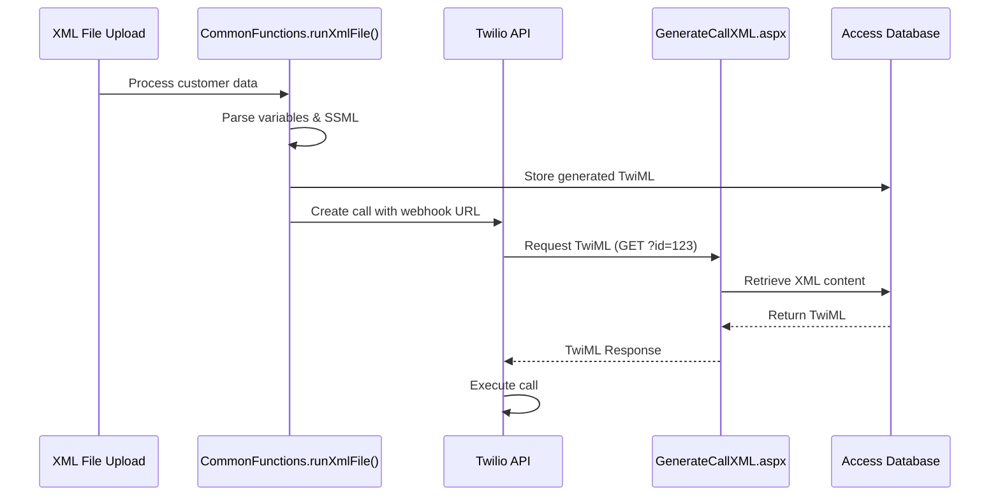
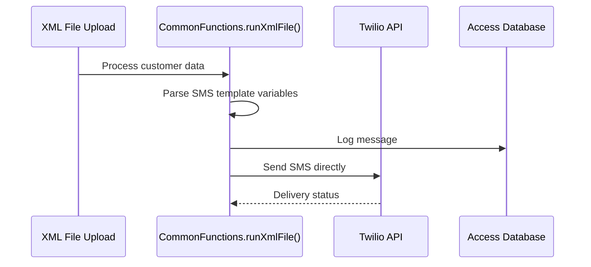

# Project Guide for AI Agents - Twilio Call and SMS Manager

## 🎯 Project Overview

**Application Name**: Twilio Call and SMS Manager  
**Technology**: ASP.NET Web Forms (.NET Framework 4.5)  
**Language**: VB.NET  
**Database**: Microsoft Access (tropo.mdb)  
**Primary Function**: Voice and SMS automation using Twilio API  
**Architecture**: Legacy Web Site Project (not Web Application Project)

This application manages voice calls and SMS messages through Twilio's API, featuring an administrative interface for content management and automated XML generation for Twilio webhooks.

## 📂 Critical Directory Structure

```
📁 ROOT (y:/Projects/twiliocallandsms)
├── 📄 Web.config                    # Main application configuration
├── 📄 packages.config               # NuGet package definitions
├── 📄 GenerateCallXML.aspx(.vb)     # 🔥 CRITICAL: Twilio webhook endpoint
├── 📄 *upload.asp                   # Classic ASP file upload handlers
├── 📁 Admin/                        # Administrative interface
│   ├── 📄 login.aspx(.vb)           # Authentication system
│   ├── 📄 Default.aspx(.vb)         # Admin dashboard
│   ├── 📄 manage*.aspx(.vb)         # Voice/SMS/file management
│   ├── 📁 include/                  # Shared user controls
│   │   ├── 📄 top.ascx(.vb)         # Header control
│   │   └── 📄 bottom.ascx(.vb)      # Footer control
│   ├── 📁 css/                      # Admin stylesheets
│   ├── 📁 images/                   # Admin UI assets
│   └── 📁 js/                       # jQuery and custom JS
├── 📁 App_Code/                     # 🔥 BUSINESS LOGIC CLASSES
│   ├── 📄 CommonFunctions.vb        # Core utilities and Twilio integration
│   ├── 📄 Security.vb               # User authentication and authorization
│   └── 📄 VoiceClass.vb             # Voice/SMS operations and database
├── 📁 App_Data/                     # Data and configuration
│   ├── 📄 tropo.mdb                 # 🔥 MAIN DATABASE
│   └── 📁 PublishProfiles/          # Deployment configurations
├── 📁 Bin/                          # Compiled assemblies
│   ├── 📄 Twilio.dll                # Twilio SDK v5.24.0
│   ├── 📄 AjaxControlToolkit.dll    # AJAX controls
│   └── 📄 Newtonsoft.Json.dll       # JSON processing
├── 📁 files/mp3/                    # Audio file storage
├── 📁 ErrorLog/                     # Application error logging
└── 📁 css/, js/                     # Frontend assets
```

## 🔧 Technology Stack Details

### Framework & Runtime
- **ASP.NET Web Forms 4.5** (Legacy model - NO .sln/.csproj files)
- **VB.NET** (Visual Basic .NET)
- **IIS/ASP.NET Runtime** compilation

### Database
- **Microsoft Access (.mdb)** via OLE DB
- **Connection String**: `Provider=Microsoft.Jet.OLEDB.4.0;Data Source=|DataDirectory|tropo.mdb`
- **Location**: `App_Data/tropo.mdb`

### External Dependencies
```xml
<!-- From packages.config -->
<package id="Twilio" version="5.24.0" targetFramework="net45" />
```

### Key Libraries
- **Twilio SDK**: SMS/Voice communication
- **AjaxControlToolkit**: AJAX-enabled web controls
- **Newtonsoft.Json**: JSON serialization
- **jQuery**: Frontend interactions

## 🗄️ Database Schema (Access .mdb)

### Core Tables
```sql
-- Users table (authentication)
Users: UserID, Username, Password, UName, Email, Taglist, IsMainAdmin, canManageTags, IsActive

-- Voice messages/templates
Voice: ID, Name, VoiceText, VoiceGender, VoiceAge, VoiceRate, TropoVoice, VoiceType, IsActive

-- File management
VoiceFile: ID, Filename, FileType, Description, Taglist, CallerNumber, EntryDate, UpdatedDate

-- Generated XML for Twilio
VoiceXML: ID, xmlCont, XMLFileName

-- Logging
CallLog: ID, network, msg, xmlfile, entrydate
ErrorLog: ID, ErrorMessage, entrydate

-- User permissions
Rights: RightsID, RightsType, ParentID, IsActive
UsersRights: UserID, RightsID
```

## 🚪 Critical Entry Points

### 1. Twilio Webhook (PRIMARY API ENDPOINT)
**File**: `GenerateCallXML.aspx`
```vb
' Accepts: ?id={VoiceXMLID}
' Returns: TwiML XML for voice calls
' Usage: Called by Twilio when call is answered
```

### 2. Admin Authentication
**File**: `Admin/login.aspx`
```vb
' Session-based authentication
' Stores: userid, usertaglist, userIsAdmin, hasTagRights, IsAuthorized
```

### 3. File Upload Handlers
**Files**: `fileupload.asp`, `mp3upload.asp`, `uploadfile.aspx`, `uploadmp3.aspx`
```asp
' Classic ASP and ASP.NET upload handlers
' Stores files in /files/mp3/ directory
```

## 📋 Key Classes and Functions

### CommonFunctions.vb
```vb
' PRIMARY CLASS for Twilio integration
Public Class CommonFunctions
    ' CRITICAL METHOD: Processes XML files and triggers calls/SMS
    Public Sub runXmlFile(Path As String, ActualFileName As String, CallerNumber As String)
    
    ' Helper: Creates SSML markup for voice
    Public Function say_as(ByVal value As String, ByVal type As String) As String
    
    ' Helper: Grid pagination
    Sub BindPagingInGrid(...)
End Class
```

### VoiceClass.vb
```vb
' DATABASE OPERATIONS for voice/SMS management
Public Class VoiceClass
    ' Data models
    Public Class VoiceData
    Public Class VoiceFileData
    
    ' CRUD operations
    Public Function AddVoice(ByVal DisData As VoiceData) As Double
    Public Function GetVoiceReader(ByVal WhereQry As String) As OleDbDataReader
    Public Function GetxmlCont(VoiceXMLid As Integer) As String  ' Used by Twilio webhook
    
    ' File management
    Public Sub insertfiledetail(...)
    Public Sub insertQuery(ByVal Qry As String)  ' Generic database insert
End Class
```

### Security.vb
```vb
' USER AUTHENTICATION AND AUTHORIZATION
Public Class security
    Public Class UserData  ' User data model
    
    ' CRITICAL: Login validation
    Public Function UserLogin(ByVal Username As String, ByVal Password As String) As UserData
    
    ' Permission checking
    Public Function IsAutherised(ByVal Userid As Integer, ByVal RightsType As String) As Boolean
End Class
```

## 🔄 Application Flow

### Voice Call Process


### SMS Process


## ⚙️ Configuration Details

### Web.config Critical Settings
```xml
<!-- Database Connection -->
<add name="ConnectionString" connectionString="Provider=Microsoft.Jet.OLEDB.4.0;Data Source=|DataDirectory|tropo.mdb; Persist Security Info=False"/>

<!-- Twilio Credentials (SECURITY RISK - HARDCODED) -->
<add key="accountSid" value="AC30d60c85ff4d807830379abc975b1ed1"/>
<add key="authToken" value="dd5494a80a834e37b928ab13f5ce759f"/>
<add key="fromNumber" value="+12675926678"/>

<!-- Application URLs -->
<add key="BasePath" value="http://compudimeco.web713.discountasp.net/callsms/"/>

<!-- Framework Settings -->
<compilation debug="true" targetFramework="4.5">
<authentication mode="Windows"/>
```

## 🔒 Security Considerations

### ⚠️ CRITICAL SECURITY ISSUES
1. **Hardcoded Credentials**: Twilio secrets in Web.config
2. **SQL Injection**: Direct string concatenation in database queries
3. **No Input Validation**: User inputs not sanitized
4. **Session Management**: Basic session-based auth without encryption
5. **Access Database**: Not suitable for production security

### Authentication Flow
```vb
' Session variables set on login:
Session("userid") = RetVal
Session("usertaglist") = Udata.Taglist
Session("userIsAdmin") = Udata.IsMainAdmin
Session("hasTagRights") = Udata.canManageTags
Session("IsAuthorized") = True
```

## 🚀 Deployment Information

### Current Hosting
- **Platform**: DiscountASP.NET shared hosting
- **Method**: File system deployment with precompilation
- **URL**: `compudimeco.web713.discountasp.net/callsms/`

### Deployment Profile
```xml
<!-- From App_Data/PublishProfiles/Tropo.pubxml -->
<WebPublishMethod>FileSystem</WebPublishMethod>
<PrecompileBeforePublish>True</PrecompileBeforePublish>
<EnableUpdateable>True</EnableUpdateable>
<SingleAssemblyName>Tropo</SingleAssemblyName>
```

## 🛠️ Common Development Tasks

### Adding New Voice Templates
1. Access `Admin/xmladd.aspx` or use `VoiceClass.AddVoice()`
2. Support variable placeholders: `{VariableName}`
3. SSML markup: `{VariableName}~SSML~number|currency|digits|phone|date|time`
4. MP3 files: `{MP3~filename}` (references /files/mp3/filename.mp3)

### Database Operations
```vb
' Always use VoiceClass for database operations
Dim VoiceObj As VoiceClass = New VoiceClass()
Dim reader As OleDbDataReader = VoiceObj.GetVoiceReader(" WHERE id = 123")
VoiceObj.insertQuery("INSERT INTO ...")
```

### Error Logging
```vb
' Automatic logging to ErrorLog/ErrorLog.txt and database
VoiceOBj.insertQuery("insert into Errorlog(Errormessage,entrydate) values('ERROR','" & DateTime.Now & "')")
```

## 🐛 Known Issues & Limitations

### Technical Debt
- **Legacy Framework**: .NET Framework 4.5 (EOL approaching)
- **Database**: Access not scalable for production
- **Architecture**: Tightly coupled, no separation of concerns
- **Testing**: No unit tests or automated testing

### Scalability Issues
- Single Access database file
- No connection pooling
- No caching mechanism
- Synchronous operations only

### Security Vulnerabilities
- SQL injection in multiple locations
- Hardcoded credentials
- No HTTPS enforcement in configuration
- Basic authentication mechanism

## 🔮 Modernization Roadmap

### Phase 1: Security & Stability
```
✅ Secure credential management (Azure Key Vault/appsettings)
✅ Input validation and parameterized queries
✅ HTTPS enforcement
✅ Error handling improvements
```

### Phase 2: Database Migration
```
✅ Migrate from Access to SQL Server/PostgreSQL
✅ Implement Entity Framework
✅ Add connection pooling
✅ Database backup strategy
```

### Phase 3: Architecture Modernization
```
✅ Convert to ASP.NET Core Web API
✅ Implement dependency injection
✅ Add repository pattern
✅ Containerize application (Docker)
```

### Phase 4: DevOps & Testing
```
✅ Add unit tests (xUnit/NUnit)
✅ CI/CD pipeline (GitHub Actions/Azure DevOps)
✅ Performance monitoring
✅ Automated deployment
```

## 🎯 AI Agent Development Guidelines

### When Working on This Project:

1. **ALWAYS** backup the Access database before making changes
2. **NEVER** modify the Twilio webhook URL structure without testing
3. **USE** VoiceClass methods for all database operations
4. **VALIDATE** all user inputs before database operations
5. **TEST** voice call flows in Twilio console before deployment
6. **PRESERVE** session state management patterns
7. **MAINTAIN** VB.NET syntax and conventions
8. **LOG** all errors to both file and database
9. **RESPECT** the Web Site Project structure (no .csproj needed)
10. **CONSIDER** security implications of any changes

### Quick Development Commands:
```bash
# No build needed - Web Site Project compiles at runtime
# Deploy by copying files to web server
# Database changes require manual Access modification
```

---

**Last Updated**: 2025-08-14  
**Framework**: ASP.NET Web Forms 4.5  
**Database**: Microsoft Access (tropo.mdb)  
**Status**: Production - Legacy System