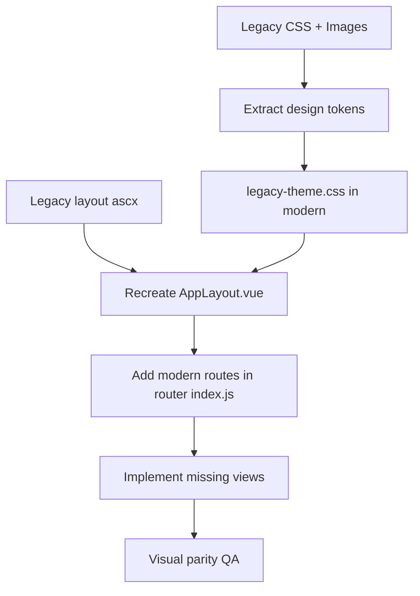
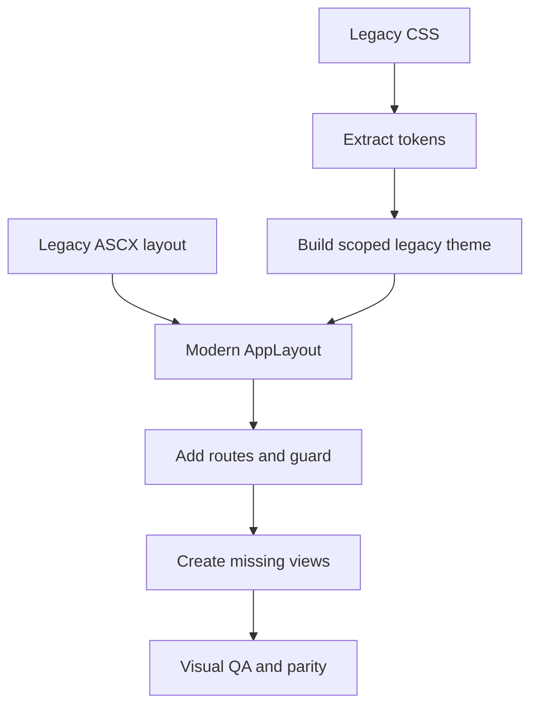
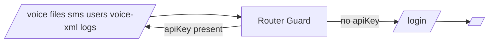

# Legacy to Modern UI Replication Plan

Purpose: Reproduce the legacy ASP.NET Web Forms admin UI look and layout in the modern Vue SPA, using modern routes (no .aspx), with an AI-executable, deterministic checklist.

Decision record
- Modern-only paths. No .aspx aliases.
- Preserve legacy look and feel via a shared layout and theme tokens.

Key repo entry points
- Vite config: [vite.config.js](modern/frontend/vite.config.js)
- SPA router: [index.js](modern/frontend/src/router/index.js)
- App layout shell: [AppLayout.vue](modern/frontend/src/components/layout/AppLayout.vue)
- Dev launcher: [start-dev.bat](start-dev.bat)
- Specs: [PROJECT_SPECIFICATION.md](docs/PROJECT_SPECIFICATION.md), [IMPLEMENTATION_ROADMAP.md](docs/IMPLEMENTATION_ROADMAP.md)

Technical anchors for agents
- Vite options defined by [defineConfig()](modern/frontend/vite.config.js:5).
- Vue Router is instantiated via [createRouter()](modern/frontend/src/router/index.js:24).
- Vite dev server port is auto-chosen by [start-dev.bat](start-dev.bat) around 5173; do not hardcode.

Legacy pages inventory
- Admin
  - [Default.aspx](legacy/Admin/Default.aspx)
  - [login.aspx](legacy/Admin/login.aspx)
  - [logout.aspx](legacy/Admin/logout.aspx)
  - [managevoice.aspx](legacy/Admin/managevoice.aspx)
  - [managevoicemain.aspx](legacy/Admin/managevoicemain.aspx)
  - [mp3add.aspx](legacy/Admin/mp3add.aspx)
  - [mp3edit.aspx](legacy/Admin/mp3edit.aspx)
  - [mp3filelist.aspx](legacy/Admin/mp3filelist.aspx)
  - [user.aspx](legacy/Admin/user.aspx)
  - [useraddmod.aspx](legacy/Admin/useraddmod.aspx)
  - [xmladd.aspx](legacy/Admin/xmladd.aspx)
  - [xmledit.aspx](legacy/Admin/xmledit.aspx)
  - [xmlfilelist.aspx](legacy/Admin/xmlfilelist.aspx)
  - Layout includes: [include/top.ascx](legacy/Admin/include/top.ascx), [include/bottom.ascx](legacy/Admin/include/bottom.ascx)
  - Styles: [css/screen.css](legacy/Admin/css/screen.css), [css/tab.css](legacy/Admin/css/tab.css), [css/Calendar.css](legacy/Admin/css/Calendar.css), [css/jquery.tag-editor.css](legacy/Admin/css/jquery.tag-editor.css)
  - Scripts: [js/js.js](legacy/Admin/js/js.js), [js/jquery.tag-editor.js](legacy/Admin/js/jquery.tag-editor.js)
  - Images: [images/](legacy/Admin/images/)
- Root utilities
  - [uploadfile.aspx](legacy/uploadfile.aspx), [uploadmp3.aspx](legacy/uploadmp3.aspx)
  - [GenerateCallXML.aspx](legacy/GenerateCallXML.aspx)

Modern route mapping plan
- /login → new LoginView (API-key-first UI, reads optional query flags like nosession)
- / → AdminDashboard (legacy Default.aspx)
- /voice → VoiceManager (managevoice, managevoicemain)
- /sms → SMSManager
- /files, /files/new, /files/:id → FileManager + add/edit flows (mp3add, mp3edit, mp3filelist)
- /users, /users/new, /users/:id → UsersList, UserForm (user, useraddmod)
- /voice-xml, /voice-xml/new, /voice-xml/:id → VoiceXmlList, VoiceXmlForm (xmladd, xmledit, xmlfilelist)
- /logs → ActivityLogs
- /logout → clears client state then redirects to /login

High-level architecture


Implementation checklist
1) Theme extraction
- Create stylesheet: modern/frontend/src/assets/styles/legacy-theme.css
- From [screen.css](legacy/Admin/css/screen.css) and [tab.css](legacy/Admin/css/tab.css), extract:
  - Colors (bg, borders, text)
  - Typography (font-family, sizes, weights)
  - Spacing and component primitives (inputs, buttons, tabs)
- Define CSS variables and utility classes that mimic the legacy styles
- If Tailwind is present, optionally map variables to Tailwind theme tokens; otherwise use plain CSS

2) Shared layout
- Analyze [include/top.ascx](legacy/Admin/include/top.ascx) and [include/bottom.ascx](legacy/Admin/include/bottom.ascx)
- Ensure [AppLayout.vue](modern/frontend/src/components/layout/AppLayout.vue) mirrors header, nav, footer structure
- Move legacy images to modern/frontend/public/legacy/admin/images and update image URLs accordingly
- Apply classes from legacy-theme.css to header, nav, body, footer to match look and feel

3) Router updates
- Edit [index.js](modern/frontend/src/router/index.js) to add missing routes
- Keep login as a top-level route (outside AppLayout) to allow a minimal unauthenticated page
- Example pattern:

```js
// router additions
{ path: '/login', name: 'Login', component: () => import('@/views/LoginView.vue') },
{
  path: '/',
  component: AppLayout,
  children: [
    { path: '', name: 'Dashboard', component: AdminDashboard },
    { path: 'voice', name: 'Voice', component: VoiceManager },
    { path: 'sms', name: 'SMS', component: SMSManager },
    { path: 'files', name: 'Files', component: FileManager },
    { path: 'logs', name: 'Logs', component: ActivityLogs },
    // New groups
    { path: 'users', name: 'Users', component: () => import('@/views/UsersList.vue') },
    { path: 'users/new', name: 'UserNew', component: () => import('@/views/UserForm.vue') },
    { path: 'users/:id', name: 'UserEdit', component: () => import('@/views/UserForm.vue') },
    { path: 'voice-xml', name: 'VoiceXml', component: () => import('@/views/VoiceXmlList.vue') },
    { path: 'voice-xml/new', name: 'VoiceXmlNew', component: () => import('@/views/VoiceXmlForm.vue') },
    { path: 'voice-xml/:id', name: 'VoiceXmlEdit', component: () => import('@/views/VoiceXmlForm.vue') },
  ]
}
```

- The router instance is created by [createRouter()](modern/frontend/src/router/index.js:24)

4) View stubs to add
- modern/frontend/src/views/LoginView.vue
- modern/frontend/src/views/UsersList.vue
- modern/frontend/src/views/UserForm.vue
- modern/frontend/src/views/VoiceXmlList.vue
- modern/frontend/src/views/VoiceXmlForm.vue

5) Login behavior
- UI: API key input first; optional username/password if required later
- Read optional flags via route.query, e.g., nosession
- On submit, store API key in client state and route to /
- Backend requests must include X-API-Key header; Vite dev proxy rewrites /api to /v1 as per [defineConfig()](modern/frontend/vite.config.js:5)

6) Files area parity
- /files shows list of MP3 and file metadata
- /files/new opens an upload form; /files/:id edits metadata
- Use existing FileManager initially, then split views if needed
- Uploads post to backend endpoints under /api/files

7) Voice XML parity
- /voice-xml shows list of XML TwiML entries
- New and edit forms generate and preview TwiML
- Backend integration via /api endpoints per spec docs

8) Users parity
- /users list with add and edit flows
- Permissions and admin flags as fields

9) Styling strategy
- Prefer applying legacy-theme.css classes to structural components so pages inherit look by default
- Only add custom page CSS when necessary

10) Assets migration
- Copy legacy/Admin/images/* → modern/frontend/public/legacy/admin/images/*
- Update image paths in components to /legacy/admin/images/...

11) QA and verification
- Start dev: run [start-dev.bat](start-dev.bat)
- Navigate to /login, /, /voice, /sms, /files, /users, /voice-xml, /logs
- Compare against legacy visuals and adjust spacing, colors, sprites as needed

Acceptance criteria
- All modern routes exist and render without console errors
- Layout matches legacy header, nav, footer and general styling
- Visual parity for core pages: login, dashboard, voice, files, logs
- Users and Voice XML pages implemented to stub level with navigation working
- Assets load from /legacy paths without broken links

References
- Legacy codebase under [legacy/](legacy/)
- Modern frontend under [modern/frontend/](modern/frontend/)
- Modern router at [index.js](modern/frontend/src/router/index.js)
- Vite configuration at [vite.config.js](modern/frontend/vite.config.js)
- Backend API proxy behavior defined by [defineConfig()](modern/frontend/vite.config.js:15)

Agent notes
- Maintain consistent import paths using @ alias set in [vite.config.js](modern/frontend/vite.config.js)
- Do not change API base; rely on proxy /api → backend /v1
- Avoid introducing .aspx paths; modern-only routing per decision above

Work plan checklist
- [ ] Create legacy-theme.css with tokens extracted from legacy CSS
- [ ] Migrate images to public/legacy/admin/images and update references
- [ ] Align AppLayout.vue to match legacy includes structure
- [ ] Add routes for /login, /users, /voice-xml in router
- [ ] Create view stubs: LoginView, UsersList, UserForm, VoiceXmlList, VoiceXmlForm
- [ ] Wire LoginView to store API key and route to dashboard
- [ ] Validate FileManager flows for list, add, edit
- [ ] Validate VoiceManager and SMSManager navigation and styling
- [ ] Implement basic Users and Voice XML list forms with mock data if backend not ready
- [ ] Visual QA and parity adjustments

Diagram legend links
- Router creation: [createRouter()](modern/frontend/src/router/index.js:24)
- Vite config: [defineConfig()](modern/frontend/vite.config.js:5)
---

# Legacy UI Replication Plan — v2 Enhanced Playbook

Purpose
- Make the legacy-to-modern UI replication deterministic, safe for a SPA, and fast to execute by an AI agent in one pass.
- Preserve the legacy look and feel without importing legacy CSS that breaks the SPA.
- Use modern-only routes; no .aspx paths.

Primary entry points
- Vite config: [vite.config.js](modern/frontend/vite.config.js), see [defineConfig()](modern/frontend/vite.config.js:5)
- Router: [index.js](modern/frontend/src/router/index.js), see [createRouter()](modern/frontend/src/router/index.js:24)
- Layout shell: [AppLayout.vue](modern/frontend/src/components/layout/AppLayout.vue)
- Reference visuals and structure:
  - Legacy login markup: [login.aspx](legacy/Admin/login.aspx:1)
  - Legacy layout markup: [top.ascx](legacy/Admin/include/top.ascx:1), [bottom.ascx](legacy/Admin/include/bottom.ascx:1)
  - Legacy CSS: [screen.css](legacy/Admin/css/screen.css:1), [tab.css](legacy/Admin/css/tab.css:1)
- Dev launcher: [start-dev.bat](start-dev.bat:1)

Executive summary
- DO NOT import the legacy CSS files directly, because they contain global resets that will break the SPA. Instead:
  1) Extract only the visual tokens and key component classes from the legacy CSS.
  2) Rebuild a scoped, SPA-safe stylesheet legacy-theme.css and apply it inside a legacy-scope wrapper.
  3) Recreate header/nav/footer structure in AppLayout to match the legacy look.
  4) Add missing modern routes (/login, /users, /voice-xml) and a simple auth guard.
  5) Build a LoginView that visually mirrors legacy login.aspx but uses API-key-first flow.

Key decisions
- SPA routes only; no .aspx aliases.
- Scoped legacy theme to avoid global CSS pollution.
- Copy legacy images into modern public and adjust URL paths accordingly.

Risks and constraints
- Legacy CSS includes extreme global resets such as body font-size:0 and line-height:0 [screen.css](legacy/Admin/css/screen.css:15-16). Importing as-is will blank out the SPA.
- Many backgrounds rely on image sprites in legacy/Admin/images. These need predictable absolute URLs in modern/public to avoid relative path headaches.
- Some legacy styles assume table-based layouts; we will preserve appearance but not replicate all table-based semantics unless necessary.

Mermaid overview


Section 1 — Legacy design tokens extracted

Color palette observed in [screen.css](legacy/Admin/css/screen.css:1):
- Base text: #393939
- Greys: #333333 #3d3d3d #7e7e7e #818181 #949494 #acacac #c7c7c7 #d2d2d2 #dbdbdb #ececec #e3e3e3
- Accent green: #94b52c
- Greens: #92b22c #6da827
- Accent blue: #2e74b2
- Accent red: #ce2700
- Heading h1 color: #4b4b4b

Typography (from multiple selectors)
- Families: Arial, Tahoma, Verdana, Comic Sans MS for h1
- Suggested reproduction:
  - Body: Arial, Helvetica, sans-serif
  - UI labels: Tahoma, Arial, sans-serif
  - Data tables and forms: Verdana, Tahoma, sans-serif
  - h1 legacy flair: Comic Sans MS with fallback

Metrics and components
- Borders often 1px solid #d2d2d2 or #3d3d3d
- Alternating row bg for tables: #ececec
- Messages colored via background sprites and text color hints
- Nav uses image backgrounds pro_line_*.gif
- Login uses background images login_bg.jpg and loginbox_bg.png
- Form inputs use image backgrounds e.g., form_inp.gif, inp_login.gif, etc.

Section 2 — Scoped legacy theme construction

Goal
- Build modern/frontend/src/assets/styles/legacy-theme.css that:
  - Defines CSS variables for colors and fonts derived from legacy CSS
  - Re-implements only necessary selectors (login, header, nav, tables, messages, forms)
  - Scopes all selectors under a class .legacy-scope to avoid global overrides

Create or update [main.js](modern/frontend/src/main.js) to import the theme once:
```js
// Ensure legacy theme is loaded
import '@/assets/styles/legacy-theme.css'
```

Create file: modern/frontend/src/assets/styles/legacy-theme.css (scoped)
- Absolute image URLs used for safety: /legacy/admin/images/...
- This snippet illustrates the pattern; the full file should include more ported rules as needed.

```css
/* legacy-theme.css */
/* Variables extracted from legacy CSS */
:root {
  --legacy-text: #393939;
  --legacy-text-dark: #333333;
  --legacy-heading: #4b4b4b;
  --legacy-gray-1: #3d3d3d;
  --legacy-gray-2: #7e7e7e;
  --legacy-gray-3: #818181;
  --legacy-gray-4: #949494;
  --legacy-gray-5: #acacac;
  --legacy-gray-6: #c7c7c7;
  --legacy-gray-7: #d2d2d2;
  --legacy-gray-8: #dbdbdb;
  --legacy-gray-9: #ececec;

  --legacy-green: #94b52c;
  --legacy-green-2: #92b22c;
  --legacy-green-3: #6da827;

  --legacy-blue: #2e74b2;
  --legacy-red: #ce2700;

  --legacy-font-body: Arial, Helvetica, sans-serif;
  --legacy-font-ui: Tahoma, Arial, sans-serif;
  --legacy-font-data: Verdana, Tahoma, sans-serif;
  --legacy-font-h1: "Comic Sans MS", "Comic Sans", cursive;
}

/* Scope everything under .legacy-scope to protect the SPA */
.legacy-scope {
  color: var(--legacy-text);
  font-family: var(--legacy-font-body);
}

/* Headings */
.legacy-scope h1 {
  color: var(--legacy-heading);
  font-family: var(--legacy-font-h1);
  font-size: 28px;
  line-height: 24px;
  font-weight: normal;
}

/* Top nav wrapper */
.legacy-scope .nav-outer-repeat {
  background: url(/legacy/admin/images/repeat.jpg) repeat-x;
  height: 77px;
}
.legacy-scope .nav-outer {
  margin: 0 auto;
  max-width: 1260px;
  min-width: 850px;
}

/* Nav bar core */
.legacy-scope .nav {
  float: left;
  font-family: var(--legacy-font-ui);
  font-size: 13px;
  height: 38px;
  position: relative;
  width: 950px;
  min-width: 600px;
  z-index: 500;
}
.legacy-scope .nav .select a {
  background: url(/legacy/admin/images/pro_line_0.gif);
  color: #fff;
  display: block;
  float: left;
  height: 37px;
  line-height: 35px;
  padding: 0 20px;
  text-decoration: none;
  white-space: nowrap;
}
.legacy-scope .nav .select a:hover,
.legacy-scope .nav .select li:hover a {
  background: url(/legacy/admin/images/pro_line_1.gif);
  color: #fff;
  padding-left: 10px;
}

/* Logout button area */
.legacy-scope #nav-right a#logout img {
  display: block;
}

/* Content wrappers */
.legacy-scope #content-outer {
  background: url(/legacy/admin/images/content_repeat.jpg) repeat-x;
}
.legacy-scope #content {
  color: #333;
  font-family: var(--legacy-font-body);
  font-size: 12px;
  line-height: 18px;
  margin: 0 auto;
  max-width: 1260px;
  min-width: 780px;
  padding: 35px 0 30px;
}

/* Tables */
.legacy-scope .gridtable {
  background-color: var(--legacy-gray-7);
  margin-bottom: 20px;
}
.legacy-scope .gridtable tr.tblrow {
  background-color: #ffffff;
}
.legacy-scope .gridtable tr.tblaltrow {
  background-color: var(--legacy-gray-9);
}
.legacy-scope .tblheader {
  background: url(/legacy/admin/images/table_header_repeat.jpg) repeat-x;
  height: 30px;
  vertical-align: middle;
  color: #ffffff;
  font-size: 13px;
  font-weight: bold;
  font-family: var(--legacy-font-ui);
}

/* Messages */
.legacy-scope .message-yellow { color: #e79300; }
.legacy-scope .message-blue { color: var(--legacy-blue); }
.legacy-scope .message-red { color: var(--legacy-red); }
.legacy-scope .message-green { color: var(--legacy-green-3); }

/* Forms and inputs */
.legacy-scope .inp-form {
  background: url(/legacy/admin/images/form_inp.gif) no-repeat;
  color: var(--legacy-text);
  height: 31px;
  padding: 0 10px;
  width: 186px;
  font-size: 14px;
  font-family: var(--legacy-font-data);
}

/* Login page wrappers */
.legacy-scope .legacy-login-bg {
  background: url(/legacy/admin/images/login_bg.jpg) no-repeat top center;
}
.legacy-scope .legacy-login-box {
  background: url(/legacy/admin/images/loginbox_bg.png) no-repeat;
  height: 212px;
  padding-top: 60px;
  width: 508px;
  position: relative;
}
.legacy-scope .login-inp {
  background: url(/legacy/admin/images/inp_login.gif) no-repeat;
  border: none;
  color: #fff;
  font-size: 16px;
  height: 28px;
  padding: 6px 6px 0 10px;
  width: 204px;
}
.legacy-scope .submit-login {
  background: url(/legacy/admin/images/submit_login.gif) no-repeat;
  border: none;
  cursor: pointer;
  display: inline-block;
  height: 29px;
  text-indent: -3000px;
  width: 73px;
}
.legacy-scope .submit-login:hover {
  background-position: 0 -29px;
}

/* Footer */
.legacy-scope #footer-left {
  color: #818181;
  font-size: 11px;
  line-height: 11px;
  padding: 15px 0 15px 25px;
  margin: 0 20px;
  border-top: 1px solid #dbdbdb;
  border-bottom: 1px solid #dbdbdb;
}
```

Asset pathing rule
- Copy entire legacy/Admin/images into modern/public/legacy/admin/images.
- Rewrite all background image URLs in the new theme to absolute paths starting with /legacy/admin/images/... for consistency.

Section 3 — Layout replication in AppLayout

Target outcome
- The modern layout [AppLayout.vue](modern/frontend/src/components/layout/AppLayout.vue) wraps its content in .legacy-scope and visually reproduces header, nav, and footer from [top.ascx](legacy/Admin/include/top.ascx:1), [bottom.ascx](legacy/Admin/include/bottom.ascx:1).

Implementation outline
- Wrap your template in a top-level div with class legacy-scope so styles apply only within the layout.
- Build a nav bar that includes:
  - A right-aligned logout link with image /legacy/admin/images/nav_logout.gif
  - A main nav bar with .nav structure using legacy CSS classes
- Add a footer area similar to #footer-left in legacy

Example structure (pseudo-markup)
```vue
<!-- AppLayout.vue additions -->
<template>
  <div class="legacy-scope">
    <div class="nav-outer-repeat">
      <div class="nav-outer">
        <div id="nav-right">
          <a id="logout" href="/logout">
            
          </a>
          <div class="clear">&nbsp;</div>
        </div>
        <div class="nav">
          <div class="table">
            <!-- Insert menu content here, static or dynamic -->
            <!-- Use .select and .current classes for styling -->
          </div>
        </div>
        <div class="clear"></div>
      </div>
    </div>

    <!-- Main content area; keep router-view -->
    <main>
      <router-view />
    </main>

    <div id="footer">
      <div id="footer-left"><i>&nbsp;</i>&nbsp;</div>
      <div class="clear">&nbsp;</div>
    </div>
  </div>
</template>
```

Section 4 — Router, login route, and auth guard

Routes to have in [index.js](modern/frontend/src/router/index.js)
- Keep the canonical SPA structure under AppLayout for authenticated pages.
- Add a top-level /login route for unauthenticated access.

Insert this route and guard
- Ensure the guard checks for an API key in storage, blocking access to protected routes if absent.

```js
// index.js additions around the router setup
import { createRouter, createWebHistory } from 'vue-router'
import AppLayout from '../components/layout/AppLayout.vue'
import AdminDashboard from '../views/AdminDashboard.vue'
import VoiceManager from '../views/VoiceManager.vue'
import SMSManager from '../views/SMSManager.vue'
import FileManager from '../views/FileManager.vue'
import ActivityLogs from '../views/ActivityLogs.vue'

const routes = [
  { path: '/login', name: 'Login', component: () => import('@/views/LoginView.vue') },
  {
    path: '/',
    component: AppLayout,
    children: [
      { path: '', name: 'Dashboard', component: AdminDashboard },
      { path: 'voice', name: 'Voice', component: VoiceManager },
      { path: 'sms', name: 'SMS', component: SMSManager },
      { path: 'files', name: 'Files', component: FileManager },
      { path: 'logs', name: 'Logs', component: ActivityLogs },
      { path: 'users', name: 'Users', component: () => import('@/views/UsersList.vue') },
      { path: 'users/new', name: 'UserNew', component: () => import('@/views/UserForm.vue') },
      { path: 'users/:id', name: 'UserEdit', component: () => import('@/views/UserForm.vue') },
      { path: 'voice-xml', name: 'VoiceXml', component: () => import('@/views/VoiceXmlList.vue') },
      { path: 'voice-xml/new', name: 'VoiceXmlNew', component: () => import('@/views/VoiceXmlForm.vue') },
      { path: 'voice-xml/:id', name: 'VoiceXmlEdit', component: () => import('@/views/VoiceXmlForm.vue') },
    ]
  },
]

const router = createRouter({
  history: createWebHistory(),
  routes,
})

// Simple guard; enhance later with real auth
router.beforeEach((to, from, next) => {
  const isPublic = to.path === '/login'
  const apiKey = localStorage.getItem('apiKey')
  if (!isPublic && !apiKey) {
    return next({ path: '/login' })
  }
  next()
})

export default router
```

Reference for router creation: [createRouter()](modern/frontend/src/router/index.js:24)

Section 5 — Login view that mirrors legacy login.aspx

Reference legacy: [login.aspx](legacy/Admin/login.aspx:1)

Create file: modern/frontend/src/views/LoginView.vue
- Scoped under legacy-scope and reproduces the login box visuals
- API-key-first, optional username/password later

```vue
<template>
  <div class="legacy-scope">
    <div class="legacy-login-bg" style="min-height: 100vh;">
      <div id="login-holder" class="mx-auto" style="width:508px; padding-top: 120px;">
        <div id="loginbox" class="legacy-login-box mx-auto">
          <div id="login-inner" class="mx-auto" style="width:310px; font-family: Tahoma; font-size:13px;">
            <div class="text-center" style="padding-bottom: 12px;">
              <span v-if="message" style="color:#fff">{{ message }}</span>
            </div>
            <form @submit.prevent="onSubmit">
              <table border="0" cellpadding="0" cellspacing="0" style="width:100%;">
                <tr>
                  <th style="text-align:left; width:95px;">API Key</th>
                  <td>
                    <input v-model="apiKey" class="login-inp" type="text" required />
                  </td>
                </tr>
                <tr>
                  <th></th>
                  <td>
                    <button class="submit-login" type="submit">Login</button>
                  </td>
                </tr>
              </table>
            </form>
          </div>
          <div class="clear"></div>
        </div>
      </div>
    </div>
  </div>
</template>

<script setup>
import { ref } from 'vue'
import { useRouter, useRoute } from 'vue-router'

const router = useRouter()
const route = useRoute()

const apiKey = ref(localStorage.getItem('apiKey') || '')
const message = ref(route.query.nosession ? 'Session expired, please login again.' : '')

function onSubmit() {
  localStorage.setItem('apiKey', apiKey.value.trim())
  router.push('/')
}
</script>
```

Section 6 — API client header injection

Create or update a single client in [api.js](modern/frontend/src/utils/api.js)
- Ensure every request sends the X-API-Key header using the value stored in localStorage.

```js
// utils/api.js
import axios from 'axios'

export const api = axios.create({
  baseURL: '/api',
})

api.interceptors.request.use((config) => {
  const key = localStorage.getItem('apiKey')
  if (key) {
    config.headers['X-API-Key'] = key
  }
  return config
})
```

Note
- Vite proxy for /api → backend /v1 is already defined in [defineConfig()](modern/frontend/vite.config.js:15-19)

Section 7 — Page mapping and scope strategy

Pages to support as modern routes
- /login → LoginView.vue
- / → [AdminDashboard.vue](modern/frontend/src/views/AdminDashboard.vue)
- /voice → [VoiceManager.vue](modern/frontend/src/views/VoiceManager.vue)
- /sms → [SMSManager.vue](modern/frontend/src/views/SMSManager.vue)
- /files → [FileManager.vue](modern/frontend/src/views/FileManager.vue)
- /logs → [ActivityLogs.vue](modern/frontend/src/views/ActivityLogs.vue)
- /users, /users/new, /users/:id → UsersList.vue, UserForm.vue
- /voice-xml, /voice-xml/new, /voice-xml/:id → VoiceXmlList.vue, VoiceXmlForm.vue

Legacy areas and where to reproduce styling
- Nav and header: in [AppLayout.vue](modern/frontend/src/components/layout/AppLayout.vue) using .legacy-scope .nav-outer-repeat, .nav, and #nav-right
- Tables: gridtable, tblheader classes; apply inside list pages or table components
- Messages: message color classes; adapt as needed
- Forms: inp-form and submit styles; reuse where beneficial

Mermaid flow for guard


Section 8 — Assets migration

Copy rule
- Copy legacy/Admin/images/* → modern/frontend/public/legacy/admin/images/*

Referencing images
- Always use absolute paths starting with /legacy/admin/images/... in the new CSS
- Examples:
  - /legacy/admin/images/login_bg.jpg
  - /legacy/admin/images/loginbox_bg.png
  - /legacy/admin/images/nav_logout.gif
  - /legacy/admin/images/table_header_repeat.jpg
  - /legacy/admin/images/pro_line_0.gif
  - /legacy/admin/images/pro_line_1.gif

Section 9 — QA checklist

Visual parity checks
- Login page matches background, box styling, and input appearance
- Header, nav, and logout control appear as in legacy
- Table headers show textured background; alternating rows visible
- Primary accent colors: green for highlight, blue for info, red for error
- Typography follows legacy families at key areas: h1 special face, body and UI text

Functional checks
- /login stores API key and redirects to /
- Protected routes redirect to /login when no API key
- API requests carry X-API-Key header
- No console errors; no broken image paths

Section 10 — AI-executable work plan

Safe ordered steps
1) Create modern/frontend/src/assets/styles/legacy-theme.css with the scoped rules shown above
2) Copy legacy/Admin/images → modern/frontend/public/legacy/admin/images
3) Ensure [main.js](modern/frontend/src/main.js) imports '@/assets/styles/legacy-theme.css'
4) Update [AppLayout.vue](modern/frontend/src/components/layout/AppLayout.vue) to wrap markup in .legacy-scope and add nav and footer blocks
5) In [index.js](modern/frontend/src/router/index.js), add /login route and the router.beforeEach guard near [createRouter()](modern/frontend/src/router/index.js:24)
6) Create modern/frontend/src/views/LoginView.vue using the markup shown, including legacy-scope wrappers
7) Create or update [api.js](modern/frontend/src/utils/api.js) with the axios client and X-API-Key interceptor
8) Run dev via [start-dev.bat](start-dev.bat:1) both mode, then visit /login, /, /voice, /files, /logs
9) Adjust CSS variables and spacing in legacy-theme.css until visual parity is acceptable
10) Add UsersList.vue, UserForm.vue, VoiceXmlList.vue, VoiceXmlForm.vue stubs with legacy classes and wire their routes

Deliverables definition of done
- Visual parity for login, header/nav/footer, tables on at least one list page
- Modern routes exist and are navigable without errors
- API key guard works and header injection verified via network tab
- All legacy images referenced are found under /legacy/admin/images paths

Appendix A — Legacy page and feature crosswalk

Pages in legacy/Admin and modern mapping
- Default.aspx → / (Dashboard)
- login.aspx → /login
- logout.aspx → /logout (client clear and redirect to /login)
- managevoice.aspx managevoicemain.aspx → /voice
- mp3add.aspx mp3edit.aspx mp3filelist.aspx → /files with add and detail flows
- user.aspx useraddmod.aspx → /users /users/new /users/:id
- xmladd.aspx xmledit.aspx xmlfilelist.aspx GenerateCallXML.aspx → /voice-xml and subordinate routes
- Layout: include [top.ascx](legacy/Admin/include/top.ascx:1), [bottom.ascx](legacy/Admin/include/bottom.ascx:1) → implemented in [AppLayout.vue](modern/frontend/src/components/layout/AppLayout.vue)

Appendix B — Notes on not importing legacy CSS verbatim

Why
- Global resets in the original [screen.css](legacy/Admin/css/screen.css:15-16) will zero out font and line height across the SPA.
- Many IDs and tags are unscoped; conflicts with current Tailwind or component styles are likely.

Solution
- Extract variables and recreate only the visual rules needed under a .legacy-scope wrapper.
- Keep legacy images but modernize CSS specificity and avoid tag-wide resets.

Appendix C — References and anchors

- Vite config source: [defineConfig()](modern/frontend/vite.config.js:5)
- SPA router creation: [createRouter()](modern/frontend/src/router/index.js:24)
- Layout file: [AppLayout.vue](modern/frontend/src/components/layout/AppLayout.vue)
- Views in place:
  - [AdminDashboard.vue](modern/frontend/src/views/AdminDashboard.vue)
  - [VoiceManager.vue](modern/frontend/src/views/VoiceManager.vue)
  - [SMSManager.vue](modern/frontend/src/views/SMSManager.vue)
  - [FileManager.vue](modern/frontend/src/views/FileManager.vue)
  - [ActivityLogs.vue](modern/frontend/src/views/ActivityLogs.vue)
- Legacy sources:
  - [login.aspx](legacy/Admin/login.aspx:1)
  - [top.ascx](legacy/Admin/include/top.ascx:1)
  - [bottom.ascx](legacy/Admin/include/bottom.ascx:1)
  - [screen.css](legacy/Admin/css/screen.css:1)
  - [tab.css](legacy/Admin/css/tab.css:1)
---

# AI Execution Kit — v3 One-Pass Implementation Guide

This section upgrades the plan with executable steps, diffs, scaffolds, and validation scripts so an AI agent can complete the UI replication in one pass with minimal back-and-forth.

Quick facts and mismatches to note
- Vite port: config sets 3000 in [defineConfig()](modern/frontend/vite.config.js:13), but launcher starts the dev server around 5173/5174 via [start-dev.bat](start-dev.bat:223-245). CLI port overrides config during dev.
- Proxy: '/api' → http://localhost:8001 with '/v1' rewrite in [defineConfig()](modern/frontend/vite.config.js:15-19). Backend health path probed at [post_launch_checks()](start-dev.bat:251-261).

A. Windows PowerShell command block (assets + skeletons)

Run these in repo root (Windows 10 target):

```powershell
# 1) Ensure public image directory
New-Item -ItemType Directory -Force "modern/frontend/public/legacy/admin/images" | Out-Null

# 2) Copy legacy image assets
Copy-Item -Recurse -Force "legacy\Admin\images\*" "modern\frontend\public\legacy\admin\images"

# 3) Ensure styles directory exists
New-Item -ItemType Directory -Force "modern/frontend/src/assets/styles" | Out-Null

# 4) Create theme file if missing (content provided below in Section C)
if (-not (Test-Path "modern/frontend/src/assets/styles/legacy-theme.css")) {
  New-Item -ItemType File -Force "modern/frontend/src/assets/styles/legacy-theme.css" | Out-Null
}

# 5) Create empty stubs for new views (content provided below in Section D)
$views = @(
  "modern/frontend/src/views/LoginView.vue",
  "modern/frontend/src/views/UsersList.vue",
  "modern/frontend/src/views/UserForm.vue",
  "modern/frontend/src/views/VoiceXmlList.vue",
  "modern/frontend/src/views/VoiceXmlForm.vue"
)
foreach ($v in $views) {
  if (-not (Test-Path $v)) {
    New-Item -ItemType File -Force $v | Out-Null
  }
}

# 6) Ensure utils directory exists and API client stub is present
New-Item -ItemType Directory -Force "modern/frontend/src/utils" | Out-Null
if (-not (Test-Path "modern/frontend/src/utils/api.js")) {
  New-Item -ItemType File -Force "modern/frontend/src/utils/api.js" | Out-Null
}
```

B. Diffs to apply (surgical changes)

1) AppLayout: wrap content with a legacy scope container and add footer shell

Current file for reference: [AppLayout.vue](modern/frontend/src/components/layout/AppLayout.vue)

Intended goals:
- Wrap with `<div class="legacy-scope">`
- Keep existing Header/Sidebar for now (to avoid breaking current SPA), but style outer wrappers to match legacy feel
- Add footer block structure similar to [bottom.ascx](legacy/Admin/include/bottom.ascx:1)

Proposed update pattern:
- Surround existing top-level template root with `<div class="legacy-scope"> ... </div>`
- Append footer DOM at end of template, modeled after legacy `#footer` and `#footer-left`

2) Router: add /login and a light auth guard

File: [index.js](modern/frontend/src/router/index.js)

Insertions:
- Top-level route `{ path: '/login', name: 'Login', component: () => import('@/views/LoginView.vue') }`
- A beforeEach guard that checks `localStorage.getItem('apiKey')` and redirects to /login if missing for protected routes (all under '/')

Exact example available in Section E below.

3) API client: inject X-API-Key header on all requests

File: [api.js](modern/frontend/src/utils/api.js)

Add axios instance and a request interceptor. See Section F for full content.

C. Complete legacy-theme.css (scoped, SPA-safe)

Create/update: [legacy-theme.css](modern/frontend/src/assets/styles/legacy-theme.css)

Paste the full content below. It encapsulates legacy visuals under `.legacy-scope` and remaps all image URLs to `/legacy/admin/images/...` public paths. It includes the login, nav, table headers, forms, messages, and footer styles extracted from legacy CSS, without the destructive global resets.

```css
/* legacy-theme.css - scoped legacy visual system for SPA safety */
/* Variables */
:root {
  --legacy-text: #393939;
  --legacy-text-dark: #333333;
  --legacy-heading: #4b4b4b;
  --legacy-gray-1: #3d3d3d;
  --legacy-gray-2: #7e7e7e;
  --legacy-gray-3: #818181;
  --legacy-gray-4: #949494;
  --legacy-gray-5: #acacac;
  --legacy-gray-6: #c7c7c7;
  --legacy-gray-7: #d2d2d2;
  --legacy-gray-8: #dbdbdb;
  --legacy-gray-9: #ececec;

  --legacy-green: #94b52c;
  --legacy-green-2: #92b22c;
  --legacy-green-3: #6da827;

  --legacy-blue: #2e74b2;
  --legacy-red: #ce2700;

  --legacy-font-body: Arial, Helvetica, sans-serif;
  --legacy-font-ui: Tahoma, Arial, sans-serif;
  --legacy-font-data: Verdana, Tahoma, sans-serif;
  --legacy-font-h1: "Comic Sans MS", "Comic Sans", cursive;
}

/* Scope */
.legacy-scope {
  color: var(--legacy-text);
  font-family: var(--legacy-font-body);
}
.legacy-scope h1 {
  color: var(--legacy-heading);
  font-family: var(--legacy-font-h1);
  font-size: 28px;
  line-height: 24px;
  font-weight: normal;
}

/* Nav region */
.legacy-scope .nav-outer-repeat {
  background: url(/legacy/admin/images/repeat.jpg) repeat-x;
  height: 77px;
}
.legacy-scope .nav-outer {
  margin: 0 auto;
  max-width: 1260px;
  min-width: 850px;
}
.legacy-scope #nav-right {
  float: right;
  position: relative;
  width: 150px;
  z-index: 0;
}
.legacy-scope .nav {
  float: left;
  font-family: var(--legacy-font-ui);
  font-size: 13px;
  height: 38px;
  position: relative;
  width: 950px;
  min-width: 600px;
  z-index: 500;
}
.legacy-scope .nav .table {
  display: table;
}
.legacy-scope .nav .select {
  display: table-cell;
  float: left;
  list-style: none;
  white-space: nowrap;
}
.legacy-scope .nav .select a {
  background: url(/legacy/admin/images/pro_line_0.gif);
  color: #fff;
  display: block;
  float: left;
  height: 37px;
  line-height: 35px;
  padding: 0 20px;
  text-decoration: none;
  white-space: nowrap;
}
.legacy-scope .nav .select a:hover,
.legacy-scope .nav .select li:hover a {
  background: url(/legacy/admin/images/pro_line_1.gif);
  color: #fff;
  padding-left: 10px;
}

/* Content wrappers */
.legacy-scope #content-outer {
  background: url(/legacy/admin/images/content_repeat.jpg) repeat-x;
}
.legacy-scope #content {
  color: #333;
  font-family: var(--legacy-font-body);
  font-size: 12px;
  line-height: 18px;
  margin: 0 auto;
  max-width: 1260px;
  min-width: 780px;
  padding: 35px 0 30px;
}

/* Tables and headers */
.legacy-scope .gridtable {
  background-color: var(--legacy-gray-7);
  margin-bottom: 20px;
}
.legacy-scope .gridtable tr.tblrow { background-color: #ffffff; }
.legacy-scope .gridtable tr.tblaltrow { background-color: var(--legacy-gray-9); }
.legacy-scope .tblheader {
  background: url(/legacy/admin/images/table_header_repeat.jpg) repeat-x;
  height: 30px;
  vertical-align: middle;
  color: #ffffff;
  font-size: 13px;
  font-weight: bold;
  font-family: var(--legacy-font-ui);
}

/* Messages (colors only; feel free to use Tailwind utility containers) */
.legacy-scope .message-yellow { color: #e79300; }
.legacy-scope .message-blue { color: var(--legacy-blue); }
.legacy-scope .message-red { color: var(--legacy-red); }
.legacy-scope .message-green { color: var(--legacy-green-3); }

/* Forms */
.legacy-scope .inp-form {
  background: url(/legacy/admin/images/form_inp.gif) no-repeat;
  color: var(--legacy-text);
  height: 31px;
  padding: 0 10px;
  width: 186px;
  font-size: 14px;
  font-family: var(--legacy-font-data);
}

/* Login page */
.legacy-scope .legacy-login-bg {
  background: url(/legacy/admin/images/login_bg.jpg) no-repeat top center;
}
.legacy-scope .legacy-login-box {
  background: url(/legacy/admin/images/loginbox_bg.png) no-repeat;
  height: 212px;
  padding-top: 60px;
  width: 508px;
  position: relative;
}
.legacy-scope .login-inp {
  background: url(/legacy/admin/images/inp_login.gif) no-repeat;
  border: none;
  color: #fff;
  font-size: 16px;
  height: 28px;
  padding: 6px 6px 0 10px;
  width: 204px;
}
.legacy-scope .submit-login {
  background: url(/legacy/admin/images/submit_login.gif) no-repeat;
  border: none;
  cursor: pointer;
  display: inline-block;
  height: 29px;
  text-indent: -3000px;
  width: 73px;
}
.legacy-scope .submit-login:hover {
  background-position: 0 -29px;
}

/* Footer */
.legacy-scope #footer-left {
  color: #818181;
  font-size: 11px;
  line-height: 11px;
  padding: 15px 0 15px 25px;
  margin: 0 20px;
  border-top: 1px solid #dbdbdb;
  border-bottom: 1px solid #dbdbdb;
}
```

D. View scaffolds (copy-paste)

1) Login (visual parity to [login.aspx](legacy/Admin/login.aspx:1))

Create/update: [LoginView.vue](modern/frontend/src/views/LoginView.vue)

```vue
<template>
  <div class="legacy-scope">
    <div class="legacy-login-bg" style="min-height: 100vh;">
      <div id="login-holder" class="mx-auto" style="width:508px; padding-top: 120px;">
        <div id="loginbox" class="legacy-login-box mx-auto">
          <div id="login-inner" class="mx-auto" style="width:310px; font-family: Tahoma; font-size:13px;">
            <div class="text-center" style="padding-bottom: 12px;">
              <span v-if="message" style="color:#fff">{{ message }}</span>
            </div>
            <form @submit.prevent="onSubmit">
              <table border="0" cellpadding="0" cellspacing="0" style="width:100%;">
                <tr>
                  <th style="text-align:left; width:95px;">API Key</th>
                  <td>
                    <input v-model="apiKey" class="login-inp" type="text" required />
                  </td>
                </tr>
                <tr>
                  <th></th>
                  <td>
                    <button class="submit-login" type="submit">Login</button>
                  </td>
                </tr>
              </table>
            </form>
          </div>
          <div class="clear"></div>
        </div>
      </div>
    </div>
  </div>
</template>

<script setup>
import { ref } from 'vue'
import { useRouter, useRoute } from 'vue-router'
const router = useRouter()
const route = useRoute()
const apiKey = ref(localStorage.getItem('apiKey') || '')
const message = ref(route.query.nosession ? 'Session expired, please login again.' : '')
function onSubmit() {
  localStorage.setItem('apiKey', apiKey.value.trim())
  router.push('/')
}
</script>
```

2) Users List

Create: [UsersList.vue](modern/frontend/src/views/UsersList.vue)

```vue
<template>
  <div class="legacy-scope">
    <h1>Users</h1>
    <div class="gridtable">
      <div class="tblheader px-3">User List</div>
      <table class="w-full">
        <thead>
          <tr class="tblrow">
            <th class="text-left p-2">Username</th>
            <th class="text-left p-2">Display Name</th>
            <th class="text-left p-2">Email</th>
          </tr>
        </thead>
        <tbody>
          <tr v-for="u in users" :key="u.id" class="tblrow">
            <td class="p-2">{{ u.username }}</td>
            <td class="p-2">{{ u.display_name }}</td>
            <td class="p-2">{{ u.email }}</td>
          </tr>
        </tbody>
      </table>
    </div>
  </div>
</template>
<script setup>
import { ref, onMounted } from 'vue'
import { api } from '@/utils/api'
const users = ref([])
onMounted(async () => {
  // Replace with real endpoint when available
  users.value = (await api.get('/users').catch(() => ({ data: { data: [] }}))).data.data || []
})
</script>
```

3) User Form

Create: [UserForm.vue](modern/frontend/src/views/UserForm.vue)

```vue
<template>
  <div class="legacy-scope">
    <h1>User</h1>
    <div class="gridtable p-4">
      <form @submit.prevent="save">
        <div class="mb-3">
          <label class="mr-2">Username</label>
          <input v-model="form.username" class="inp-form" />
        </div>
        <div class="mb-3">
          <label class="mr-2">Display Name</label>
          <input v-model="form.display_name" class="inp-form" />
        </div>
        <div class="mb-3">
          <label class="mr-2">Email</label>
          <input v-model="form.email" class="inp-form" />
        </div>
        <button class="submit-login" type="submit">Save</button>
      </form>
    </div>
  </div>
</template>
<script setup>
import { reactive } from 'vue'
import { useRoute, useRouter } from 'vue-router'
import { api } from '@/utils/api'
const route = useRoute()
const router = useRouter()
const form = reactive({ username: '', display_name: '', email: '' })
async function save() {
  if (route.params.id) {
    await api.put(`/users/${route.params.id}`, form).catch(() => {})
  } else {
    await api.post(`/users`, form).catch(() => {})
  }
  router.push('/users')
}
</script>
```

4) Voice XML List

Create: [VoiceXmlList.vue](modern/frontend/src/views/VoiceXmlList.vue)

```vue
<template>
  <div class="legacy-scope">
    <h1>Voice XML</h1>
    <div class="gridtable">
      <div class="tblheader px-3">XML Entries</div>
      <table class="w-full">
        <thead>
          <tr class="tblrow">
            <th class="text-left p-2">ID</th>
            <th class="text-left p-2">Filename</th>
            <th class="text-left p-2">Active</th>
          </tr>
        </thead>
        <tbody>
          <tr v-for="x in items" :key="x.id" class="tblrow">
            <td class="p-2">{{ x.id }}</td>
            <td class="p-2">{{ x.xml_filename }}</td>
            <td class="p-2">{{ x.is_active ? 'Yes' : 'No' }}</td>
          </tr>
        </tbody>
      </table>
    </div>
  </div>
</template>
<script setup>
import { ref, onMounted } from 'vue'
import { api } from '@/utils/api'
const items = ref([])
onMounted(async () => {
  // Replace with real endpoint when available
  items.value = (await api.get('/voice-xml').catch(() => ({ data: { data: [] }}))).data.data || []
})
</script>
```

5) Voice XML Form

Create: [VoiceXmlForm.vue](modern/frontend/src/views/VoiceXmlForm.vue)

```vue
<template>
  <div class="legacy-scope">
    <h1>Voice XML Editor</h1>
    <div class="gridtable p-4">
      <form @submit.prevent="save">
        <div class="mb-3">
          <label class="mr-2">Filename</label>
          <input v-model="form.xml_filename" class="inp-form" />
        </div>
        <div class="mb-3">
          <label class="mr-2">Content</label>
          <textarea v-model="form.xml_content" class="inp-form" style="height:120px;width:380px;"></textarea>
        </div>
        <div class="mb-3">
          <label class="mr-2">Active</label>
          <input type="checkbox" v-model="form.is_active" />
        </div>
        <button class="submit-login" type="submit">Save</button>
      </form>
    </div>
  </div>
</template>
<script setup>
import { reactive } from 'vue'
import { useRoute, useRouter } from 'vue-router'
import { api } from '@/utils/api'
const route = useRoute()
const router = useRouter()
const form = reactive({ xml_filename: '', xml_content: '', is_active: true })
async function save() {
  if (route.params.id) {
    await api.put(`/voice-xml/${route.params.id}`, form).catch(() => {})
  } else {
    await api.post(`/voice-xml`, form).catch(() => {})
  }
  router.push('/voice-xml')
}
</script>
```

E. Router additions and guard

File to edit: [index.js](modern/frontend/src/router/index.js)

Insertions (integrate with existing routes shown in [createRouter()](modern/frontend/src/router/index.js:24)):

```js
// New route (top-level, not under AppLayout)
{ path: '/login', name: 'Login', component: () => import('@/views/LoginView.vue') },

// ... keep existing '/' AppLayout route with children

// After router is created:
router.beforeEach((to, from, next) => {
  const isPublic = to.path === '/login'
  const apiKey = localStorage.getItem('apiKey')
  if (!isPublic && !apiKey) {
    return next({ path: '/login' })
  }
  next()
})
```

F. API client (header injection)

Create/update: [api.js](modern/frontend/src/utils/api.js)

```js
import axios from 'axios'

export const api = axios.create({
  baseURL: '/api',
})

api.interceptors.request.use((config) => {
  const key = localStorage.getItem('apiKey')
  if (key) {
    config.headers['X-API-Key'] = key
  }
  return config
})
```

G. Visual parity acceptance

Compare to legacy selectors in:
- [screen.css](legacy/Admin/css/screen.css:1)
- [top.ascx](legacy/Admin/include/top.ascx:1)
- [bottom.ascx](legacy/Admin/include/bottom.ascx:1)
- [login.aspx](legacy/Admin/login.aspx:1)

Acceptance checks:
- Login background and box render correctly; `.submit-login` hover shifts sprite (visual state)
- Nav background strip visible, logout gif renders at top-right
- Table header uses repeated background image; alternating rows visible
- H1 headings styled with legacy font face
- No global font-size:0 or line-height:0 issues in the SPA

H. Troubleshooting matrix

- Symptom: Blank-looking text or collapsed layout
  - Cause: Unscoped import of legacy CSS (global resets)
  - Fix: Ensure only [legacy-theme.css](modern/frontend/src/assets/styles/legacy-theme.css) is imported and wrapped under `.legacy-scope`

- Symptom: Missing images in backgrounds
  - Cause: Assets not copied or relative paths incorrect
  - Fix: Verify copy to `modern/frontend/public/legacy/admin/images`; use absolute URLs `/legacy/admin/images/...`

- Symptom: Routes redirect to /login unexpectedly
  - Cause: No API key in localStorage
  - Fix: Set key via [LoginView.vue](modern/frontend/src/views/LoginView.vue) form

- Symptom: API 401s from backend
  - Cause: Missing X-API-Key header
  - Fix: Confirm axios interceptor in [api.js](modern/frontend/src/utils/api.js) and that key exists

I. Commit plan (atomic, reviewable)

1) feat(frontend): add scoped legacy theme and copy legacy images
   - Add [legacy-theme.css](modern/frontend/src/assets/styles/legacy-theme.css)
   - Copy images to public

2) feat(frontend): add login route/view and API-key guard
   - Update [index.js](modern/frontend/src/router/index.js)
   - Add [LoginView.vue](modern/frontend/src/views/LoginView.vue)
   - Add [api.js](modern/frontend/src/utils/api.js)

3) feat(frontend): add users and voice-xml view stubs
   - Add [UsersList.vue](modern/frontend/src/views/UsersList.vue)
   - Add [UserForm.vue](modern/frontend/src/views/UserForm.vue)
   - Add [VoiceXmlList.vue](modern/frontend/src/views/VoiceXmlList.vue)
   - Add [VoiceXmlForm.vue](modern/frontend/src/views/VoiceXmlForm.vue)

4) chore(frontend): style AppLayout with legacy scope and footer
   - Update [AppLayout.vue](modern/frontend/src/components/layout/AppLayout.vue)

J. PR checklist (copy into PR description)

- [ ] Images copied to modern public and accessible at /legacy/admin/images
- [ ] [legacy-theme.css](modern/frontend/src/assets/styles/legacy-theme.css) scoped; no legacy CSS imported globally
- [ ] [index.js](modern/frontend/src/router/index.js) has /login route and guard
- [ ] [LoginView.vue](modern/frontend/src/views/LoginView.vue) saves API key and redirects
- [ ] [api.js](modern/frontend/src/utils/api.js) sends X-API-Key on requests
- [ ] App layout wrapped with `.legacy-scope` and footer added
- [ ] Visual parity verified for: login, nav bar strip, table header, alternating rows
- [ ] No console errors; network calls show X-API-Key when key is set

K. Optional: Responsive posture

Legacy UI uses fixed widths; keep original fixed-width behavior while allowing SPA container to scroll. Avoid forcing modern responsive changes in this pass to maintain parity.

L. Phase 2 ideas (beyond parity)

- Extract legacy menu items into a JSON-driven nav and render tabs/menus with same visuals
- Gradually replace image-sliced buttons with CSS-only equivalents while maintaining look
- Convert grid tables into reusable table components with legacy class names baked-in