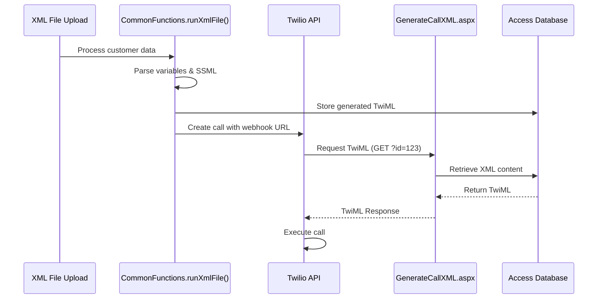
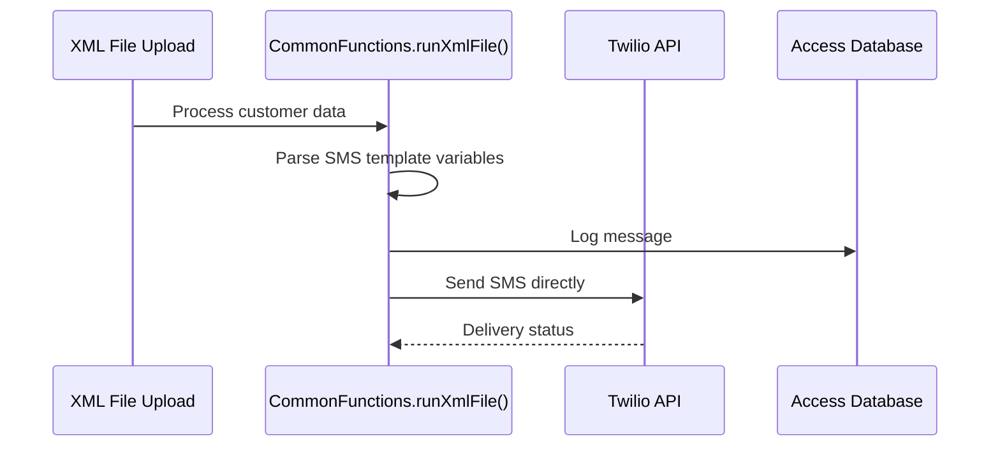

# Project Guide for AI Agents - Twilio Call and SMS Manager

## 🎯 Project Overview

**Application Name**: Twilio Call and SMS Manager  
**Technology**: ASP.NET Web Forms (.NET Framework 4.5)  
**Language**: VB.NET  
**Database**: Microsoft Access (tropo.mdb)  
**Primary Function**: Voice and SMS automation using Twilio API  
**Architecture**: Legacy Web Site Project (not Web Application Project)

This application manages voice calls and SMS messages through Twilio's API, featuring an administrative interface for content management and automated XML generation for Twilio webhooks.

## 📂 Critical Directory Structure

```
📁 ROOT (y:/Projects/twiliocallandsms)
├── 📁 legacy/                       # 🔒 LEGACY SYSTEM (Reference Only)
│   ├── 📄 Web.config                # Main application configuration
│   ├── 📄 packages.config           # NuGet package definitions
│   ├── 📄 GenerateCallXML.aspx(.vb) # 🔥 CRITICAL: Twilio webhook endpoint
│   ├── 📄 *upload.asp               # Classic ASP file upload handlers
│   ├── 📁 Admin/                    # Administrative interface
│   │   ├── 📄 login.aspx(.vb)       # Authentication system
│   │   ├── 📄 Default.aspx(.vb)     # Admin dashboard
│   │   ├── 📄 manage*.aspx(.vb)     # Voice/SMS/file management
│   │   ├── 📁 include/              # Shared user controls
│   │   ├── 📁 css/                  # Admin stylesheets
│   │   ├── 📁 images/               # Admin UI assets
│   │   └── 📁 js/                   # jQuery and custom JS
│   ├── 📁 App_Code/                 # 🔥 BUSINESS LOGIC CLASSES
│   │   ├── 📄 CommonFunctions.vb    # Core utilities and Twilio integration
│   │   ├── 📄 Security.vb           # User authentication and authorization
│   │   └── 📄 VoiceClass.vb         # Voice/SMS operations and database
│   ├── 📁 App_Data/                 # Data and configuration
│   │   ├── 📄 tropo.mdb             # 🔥 MAIN DATABASE
│   │   └── 📁 PublishProfiles/      # Deployment configurations
│   ├── 📁 Bin/                      # Compiled assemblies
│   ├── 📁 files/mp3/                # Audio file storage
│   ├── 📁 ErrorLog/                 # Application error logging
│   └── 📁 css/, js/                 # Frontend assets
├── 📁 modern/                       # 🚀 MODERN SYSTEM (Active Development)
│   ├── 📁 backend/                  # Python FastAPI
│   │   ├── 📁 app/                  # Main application
│   │   │   ├── 📁 api/              # API route definitions
│   │   │   ├── 📁 core/             # Core functionality
│   │   │   ├── 📁 models/           # Pydantic data models
│   │   │   ├── 📁 services/         # Business logic services
│   │   │   └── 📁 utils/            # Utility functions
│   │   └── 📁 tests/                # Backend tests
│   ├── 📁 frontend/                 # Vue.js 3 Application
│   │   ├── 📁 src/                  # Source code
│   │   │   ├── 📁 components/       # Reusable Vue components
│   │   │   ├── 📁 views/            # Page-level components
│   │   │   ├── 📁 stores/           # Pinia state management
│   │   │   └── 📁 utils/            # Frontend utilities
│   │   └── 📁 public/               # Static assets
│   └── 📁 deployment/               # Docker, Fly.io configurations
├── 📁 docs/                         # 📖 Project Documentation
│   ├── 📄 PROJECT_GUIDE_FOR_AI_AGENTS.md
│   ├── 📄 PROJECT_SPECIFICATION.md
│   └── 📄 IMPLEMENTATION_ROADMAP.md
├── 📁 migration/                    # 🔄 Migration Tools & Scripts
├── 📁 shared/                       # 🔧 Shared Resources
├── 📄 .gitignore                    # Git ignore patterns
└── 📄 README.md                     # Project overview
```

## 🔧 Technology Stack Details

### Framework & Runtime
- **ASP.NET Web Forms 4.5** (Legacy model - NO .sln/.csproj files)
- **VB.NET** (Visual Basic .NET)
- **IIS/ASP.NET Runtime** compilation

### Database
- **Microsoft Access (.mdb)** via OLE DB
- **Connection String**: `Provider=Microsoft.Jet.OLEDB.4.0;Data Source=|DataDirectory|tropo.mdb`
- **Location**: `App_Data/tropo.mdb`

### External Dependencies
```xml
<!-- From packages.config -->
<package id="Twilio" version="5.24.0" targetFramework="net45" />
```

### Key Libraries
- **Twilio SDK**: SMS/Voice communication
- **AjaxControlToolkit**: AJAX-enabled web controls
- **Newtonsoft.Json**: JSON serialization
- **jQuery**: Frontend interactions

## 🗄️ Database Schema (Access .mdb)

### Core Tables
```sql
-- Users table (authentication)
Users: UserID, Username, Password, UName, Email, Taglist, IsMainAdmin, canManageTags, IsActive

-- Voice messages/templates
Voice: ID, Name, VoiceText, VoiceGender, VoiceAge, VoiceRate, TropoVoice, VoiceType, IsActive

-- File management
VoiceFile: ID, Filename, FileType, Description, Taglist, CallerNumber, EntryDate, UpdatedDate

-- Generated XML for Twilio
VoiceXML: ID, xmlCont, XMLFileName

-- Logging
CallLog: ID, network, msg, xmlfile, entrydate
ErrorLog: ID, ErrorMessage, entrydate

-- User permissions
Rights: RightsID, RightsType, ParentID, IsActive
UsersRights: UserID, RightsID
```

## 🚪 Critical Entry Points

### 1. Twilio Webhook (PRIMARY API ENDPOINT)
**File**: `legacy/GenerateCallXML.aspx`
```vb
' Accepts: ?id={VoiceXMLID}
' Returns: TwiML XML for voice calls
' Usage: Called by Twilio when call is answered
```

### 2. Admin Authentication
**File**: `legacy/Admin/login.aspx`
```vb
' Session-based authentication
' Stores: userid, usertaglist, userIsAdmin, hasTagRights, IsAuthorized
```

### 3. File Upload Handlers
**Files**: `legacy/fileupload.asp`, `legacy/mp3upload.asp`, `legacy/uploadfile.aspx`, `legacy/uploadmp3.aspx`
```asp
' Classic ASP and ASP.NET upload handlers
' Stores files in legacy/files/mp3/ directory
```

## 📋 Key Classes and Functions

### CommonFunctions.vb
```vb
' PRIMARY CLASS for Twilio integration
Public Class CommonFunctions
    ' CRITICAL METHOD: Processes XML files and triggers calls/SMS
    Public Sub runXmlFile(Path As String, ActualFileName As String, CallerNumber As String)
    
    ' Helper: Creates SSML markup for voice
    Public Function say_as(ByVal value As String, ByVal type As String) As String
    
    ' Helper: Grid pagination
    Sub BindPagingInGrid(...)
End Class
```

### VoiceClass.vb
```vb
' DATABASE OPERATIONS for voice/SMS management
Public Class VoiceClass
    ' Data models
    Public Class VoiceData
    Public Class VoiceFileData
    
    ' CRUD operations
    Public Function AddVoice(ByVal DisData As VoiceData) As Double
    Public Function GetVoiceReader(ByVal WhereQry As String) As OleDbDataReader
    Public Function GetxmlCont(VoiceXMLid As Integer) As String  ' Used by Twilio webhook
    
    ' File management
    Public Sub insertfiledetail(...)
    Public Sub insertQuery(ByVal Qry As String)  ' Generic database insert
End Class
```

### Security.vb
```vb
' USER AUTHENTICATION AND AUTHORIZATION
Public Class security
    Public Class UserData  ' User data model
    
    ' CRITICAL: Login validation
    Public Function UserLogin(ByVal Username As String, ByVal Password As String) As UserData
    
    ' Permission checking
    Public Function IsAutherised(ByVal Userid As Integer, ByVal RightsType As String) As Boolean
End Class
```

## 🔄 Application Flow

### Voice Call Process


### SMS Process


## ⚙️ Configuration Details

### Web.config Critical Settings
```xml
<!-- Database Connection -->
<add name="ConnectionString" connectionString="Provider=Microsoft.Jet.OLEDB.4.0;Data Source=|DataDirectory|tropo.mdb; Persist Security Info=False"/>

<!-- Twilio Credentials (SECURITY RISK - HARDCODED) -->
<add key="accountSid" value="AC30d60c85ff4d807830379abc975b1ed1"/>
<add key="authToken" value="dd5494a80a834e37b928ab13f5ce759f"/>
<add key="fromNumber" value="+12675926678"/>

<!-- Application URLs -->
<add key="BasePath" value="http://compudimeco.web713.discountasp.net/callsms/"/>

<!-- Framework Settings -->
<compilation debug="true" targetFramework="4.5">
<authentication mode="Windows"/>
```

## 🔒 Security Considerations

### ⚠️ CRITICAL SECURITY ISSUES
1. **Hardcoded Credentials**: Twilio secrets in Web.config
2. **SQL Injection**: Direct string concatenation in database queries
3. **No Input Validation**: User inputs not sanitized
4. **Session Management**: Basic session-based auth without encryption
5. **Access Database**: Not suitable for production security

### Authentication Flow
```vb
' Session variables set on login:
Session("userid") = RetVal
Session("usertaglist") = Udata.Taglist
Session("userIsAdmin") = Udata.IsMainAdmin
Session("hasTagRights") = Udata.canManageTags
Session("IsAuthorized") = True
```

## 🚀 Deployment Information

### Current Hosting
- **Platform**: DiscountASP.NET shared hosting
- **Method**: File system deployment with precompilation
- **URL**: `compudimeco.web713.discountasp.net/callsms/`

### Deployment Profile
```xml
<!-- From App_Data/PublishProfiles/Tropo.pubxml -->
<WebPublishMethod>FileSystem</WebPublishMethod>
<PrecompileBeforePublish>True</PrecompileBeforePublish>
<EnableUpdateable>True</EnableUpdateable>
<SingleAssemblyName>Tropo</SingleAssemblyName>
```

## 🛠️ Common Development Tasks

### Adding New Voice Templates
1. Access `Admin/xmladd.aspx` or use `VoiceClass.AddVoice()`
2. Support variable placeholders: `{VariableName}`
3. SSML markup: `{VariableName}~SSML~number|currency|digits|phone|date|time`
4. MP3 files: `{MP3~filename}` (references /files/mp3/filename.mp3)

### Database Operations
```vb
' Always use VoiceClass for database operations
Dim VoiceObj As VoiceClass = New VoiceClass()
Dim reader As OleDbDataReader = VoiceObj.GetVoiceReader(" WHERE id = 123")
VoiceObj.insertQuery("INSERT INTO ...")
```

### Error Logging
```vb
' Automatic logging to ErrorLog/ErrorLog.txt and database
VoiceOBj.insertQuery("insert into Errorlog(Errormessage,entrydate) values('ERROR','" & DateTime.Now & "')")
```

## 🐛 Known Issues & Limitations

### Technical Debt
- **Legacy Framework**: .NET Framework 4.5 (EOL approaching)
- **Database**: Access not scalable for production
- **Architecture**: Tightly coupled, no separation of concerns
- **Testing**: No unit tests or automated testing

### Scalability Issues
- Single Access database file
- No connection pooling
- No caching mechanism
- Synchronous operations only

### Security Vulnerabilities
- SQL injection in multiple locations
- Hardcoded credentials
- No HTTPS enforcement in configuration
- Basic authentication mechanism

## 🔮 Modernization Implementation Status

### Repository Organization
```
📁 legacy/     - ASP.NET Web Forms VB.NET (preserved for reference)
📁 modern/     - FastAPI + Vue.js (active development)
📁 docs/       - Complete documentation and roadmaps
📁 migration/  - Data migration tools and scripts
📁 shared/     - Common resources and configurations
```

### Technology Migration Plan
```
Legacy System (legacy/) → Modern System (modern/)
ASP.NET Web Forms 4.5   → FastAPI (Python 3.11+)
VB.NET                  → Python
Microsoft Access        → SQLite (multi-tenant)
Session Authentication  → API key authentication
jQuery/Classic JS       → Vue.js 3 + Composition API
IIS Deployment         → Docker + Fly.io
```

### Implementation Status
```
✅ Phase 1: Legacy system analysis and documentation
✅ Phase 2: Repository structure organization
🚧 Phase 3: Modern system implementation (modern/)
📋 Phase 4: Data migration from Access to SQLite
📋 Phase 5: Feature parity validation and testing
📋 Phase 6: Production deployment and cutover
```

### Modern System Architecture (modern/)
```
Backend (modern/backend/):
- FastAPI with async/await support
- SQLite database with multi-tenant isolation
- Pydantic models for data validation
- Twilio SDK integration for voice/SMS
- API key-based authentication

Frontend (modern/frontend/):
- Vue.js 3 with Composition API
- Vite build system
- Tailwind CSS for styling
- Pinia for state management
- iframe embedding support for Delphi

Deployment (modern/deployment/):
- Docker containerization
- Fly.io cloud hosting
- Automated CI/CD pipeline
```

## 🎯 AI Agent Development Guidelines

### When Working on This Project:

#### For Legacy System Analysis (legacy/):
1. **REFERENCE ONLY** - Do not modify legacy system files
2. **ANALYZE** business logic for modern system implementation
3. **UNDERSTAND** data structures for migration planning
4. **PRESERVE** Twilio webhook compatibility requirements
5. **DOCUMENT** any missing functionality discoveries

#### For Modern System Development (modern/):
1. **FOLLOW** the implementation roadmap in `docs/IMPLEMENTATION_ROADMAP.md`
2. **REFERENCE** complete specifications in `docs/PROJECT_SPECIFICATION.md`
3. **IMPLEMENT** multi-tenant architecture with API key authentication
4. **MAINTAIN** feature parity with legacy system
5. **ENSURE** iframe embedding compatibility for Delphi applications
6. **TEST** all Twilio integrations thoroughly
7. **VALIDATE** data migration accuracy
8. **OPTIMIZE** for performance (<200ms API response times)

### Development Commands:
```bash
# Legacy System (Reference Only)
# - No development on legacy system
# - Use for understanding existing functionality

# Modern System Development
cd modern/backend
python -m venv venv
source venv/bin/activate  # Windows: venv\Scripts\activate
pip install -r requirements.txt
uvicorn app.main:app --reload

cd modern/frontend
npm install
npm run dev
```

---

**Last Updated**: 2025-08-14
**Legacy System**: ASP.NET Web Forms 4.5 + VB.NET + Microsoft Access
**Modern System**: Python FastAPI + Vue.js 3 + SQLite
**Repository**: Organized for AI agent development
**Status**: Legacy preserved, Modern system in active development