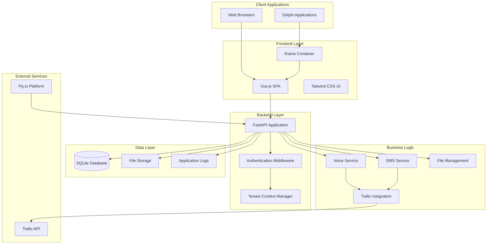

# Project Specification: Multi-Tenant Twilio Management System
## FastAPI Backend + Vue.js Frontend

### 📋 Project Overview

**Project Name**: Twilio Multi-Tenant Voice & SMS Management Platform  
**Technology Stack**: Python FastAPI + Vue.js + SQLite + Tailwind CSS  
**Target Platform**: Web application with iframe embedding capability  
**Deployment**: Fly.io cloud hosting  
**Migration Source**: Legacy ASP.NET Web Forms VB.NET application  

### 🎯 Business Objectives

#### Primary Goals
1. **Modernize Legacy System**: Migrate from ASP.NET Web Forms to modern full-stack architecture
2. **Multi-Tenant Support**: Serve up to 50 tenants with isolated data and configurations
3. **Twilio Integration**: Provide voice call and SMS management with modern Twilio SDK
4. **Delphi Integration**: Enable seamless iframe embedding in existing Delphi applications
5. **AI-Friendly Codebase**: Create maintainable, readable code for AI agent development

#### Success Metrics
- **Performance**: <200ms API response times
- **Scalability**: Support 50 tenants with 10 concurrent users each
- **Reliability**: 99.9% uptime for Twilio integrations
- **Security**: Secure API key authentication for all tenant operations
- **Cost**: <$10/month operational overhead

### 🏗️ Technical Architecture

#### System Architecture Overview


#### Technology Stack Details

**Backend Technologies:**
- **Runtime**: Python 3.11+
- **Web Framework**: FastAPI 0.104+
- **Database**: SQLite 3.40+
- **ORM**: Raw SQL queries (lightweight approach)
- **Authentication**: API Key based (header/URL parameter)
- **External SDK**: Twilio Python SDK (latest)
- **Deployment**: Docker containerization

**Frontend Technologies:**
- **Framework**: Vue.js 3.3+ (Composition API)
- **Build Tool**: Vite 4.0+
- **Styling**: Tailwind CSS 3.3+
- **HTTP Client**: Axios or Fetch API
- **State Management**: Pinia (for complex state)
- **Router**: Vue Router 4+
- **Components**: Custom components with Tailwind

**Development Tools:**
- **Package Manager**: pip (Python), npm (Node.js)
- **Code Quality**: Black (formatting), pylint (linting)
- **Testing**: pytest (backend), Vitest (frontend)
- **Documentation**: FastAPI automatic docs, Vue.js component docs

### 🗄️ Database Design

#### Schema Architecture
```sql
-- Multi-tenant database schema
-- Primary tenant configuration
CREATE TABLE tenants (
    id TEXT PRIMARY KEY,                    -- Unique tenant identifier
    name TEXT NOT NULL,                     -- Display name
    api_key TEXT UNIQUE NOT NULL,           -- Authentication key
    twilio_sid TEXT,                        -- Twilio Account SID
    twilio_token TEXT,                      -- Twilio Auth Token
    from_number TEXT,                       -- Default Twilio phone number
    is_active BOOLEAN DEFAULT 1,            -- Tenant status
    settings JSON,                          -- Additional configuration
    created_at DATETIME DEFAULT CURRENT_TIMESTAMP,
    updated_at DATETIME DEFAULT CURRENT_TIMESTAMP
);

-- Voice message templates and configurations
CREATE TABLE voice_messages (
    id INTEGER PRIMARY KEY AUTOINCREMENT,
    tenant_id TEXT NOT NULL,               -- Foreign key to tenants
    name TEXT NOT NULL,                    -- Message template name
    voice_text TEXT NOT NULL,              -- Message content with variables
    voice_gender TEXT DEFAULT 'alice',     -- TTS voice gender
    voice_age INTEGER DEFAULT 25,          -- TTS voice age
    voice_rate TEXT DEFAULT 'medium',      -- TTS speaking rate
    tropo_voice TEXT,                      -- Legacy Tropo voice setting
    voice_type TEXT DEFAULT 'message',     -- Message category
    voice_settings JSON,                   -- Additional TTS settings
    is_active BOOLEAN DEFAULT 1,
    created_at DATETIME DEFAULT CURRENT_TIMESTAMP,
    updated_at DATETIME DEFAULT CURRENT_TIMESTAMP,
    FOREIGN KEY (tenant_id) REFERENCES tenants(id) ON DELETE CASCADE
);

-- Generated XML for Twilio webhooks
CREATE TABLE voice_xml (
    id INTEGER PRIMARY KEY AUTOINCREMENT,
    tenant_id TEXT NOT NULL,
    xml_content TEXT NOT NULL,             -- Generated TwiML content
    xml_filename TEXT,                     -- Original filename reference
    voice_message_id INTEGER,              -- Reference to voice_messages
    is_active BOOLEAN DEFAULT 1,
    created_at DATETIME DEFAULT CURRENT_TIMESTAMP,
    FOREIGN KEY (tenant_id) REFERENCES tenants(id) ON DELETE CASCADE,
    FOREIGN KEY (voice_message_id) REFERENCES voice_messages(id) ON DELETE SET NULL
);

-- File management for MP3 and other assets
CREATE TABLE voice_files (
    id INTEGER PRIMARY KEY AUTOINCREMENT,
    tenant_id TEXT NOT NULL,
    filename TEXT NOT NULL,                -- Original filename
    file_type TEXT NOT NULL,               -- mp3, xml, etc.
    file_path TEXT NOT NULL,               -- Storage path
    file_size INTEGER,                     -- File size in bytes
    description TEXT,                      -- User description
    tag_list TEXT,                         -- Comma-separated tags
    caller_number TEXT,                    -- Associated phone number
    is_active BOOLEAN DEFAULT 1,
    created_at DATETIME DEFAULT CURRENT_TIMESTAMP,
    updated_at DATETIME DEFAULT CURRENT_TIMESTAMP,
    FOREIGN KEY (tenant_id) REFERENCES tenants(id) ON DELETE CASCADE
);

-- Call and SMS activity logging
CREATE TABLE communication_log (
    id INTEGER PRIMARY KEY AUTOINCREMENT,
    tenant_id TEXT NOT NULL,
    network_type TEXT NOT NULL,            -- 'call' or 'sms'
    to_number TEXT NOT NULL,               -- Destination phone number
    from_number TEXT NOT NULL,             -- Source phone number
    message_content TEXT,                  -- SMS content or call script
    twilio_sid TEXT,                       -- Twilio message/call SID
    status TEXT,                           -- success, failed, pending
    error_message TEXT,                    -- Error details if failed
    xml_filename TEXT,                     -- Associated XML file
    cost_amount DECIMAL(10,4),             -- Twilio cost
    duration_seconds INTEGER,              -- Call duration
    created_at DATETIME DEFAULT CURRENT_TIMESTAMP,
    FOREIGN KEY (tenant_id) REFERENCES tenants(id) ON DELETE CASCADE
);

-- Error logging and debugging
CREATE TABLE error_log (
    id INTEGER PRIMARY KEY AUTOINCREMENT,
    tenant_id TEXT,                        -- NULL for system-wide errors
    error_type TEXT NOT NULL,              -- 'api', 'twilio', 'database', etc.
    error_message TEXT NOT NULL,
    error_details JSON,                    -- Stack trace, request data
    endpoint TEXT,                         -- API endpoint where error occurred
    user_agent TEXT,                       -- Client information
    ip_address TEXT,                       -- Request IP
    created_at DATETIME DEFAULT CURRENT_TIMESTAMP,
    FOREIGN KEY (tenant_id) REFERENCES tenants(id) ON DELETE SET NULL
);

-- User management (simplified from original ASP.NET)
CREATE TABLE users (
    id INTEGER PRIMARY KEY AUTOINCREMENT,
    tenant_id TEXT NOT NULL,
    username TEXT NOT NULL,
    password_hash TEXT NOT NULL,           -- bcrypt hashed password
    display_name TEXT NOT NULL,
    email TEXT,
    permissions JSON,                      -- User permissions object
    is_admin BOOLEAN DEFAULT 0,
    is_active BOOLEAN DEFAULT 1,
    last_login_at DATETIME,
    created_at DATETIME DEFAULT CURRENT_TIMESTAMP,
    updated_at DATETIME DEFAULT CURRENT_TIMESTAMP,
    FOREIGN KEY (tenant_id) REFERENCES tenants(id) ON DELETE CASCADE,
    UNIQUE(tenant_id, username)
);

-- Performance indexes
CREATE INDEX idx_tenants_api_key ON tenants(api_key);
CREATE INDEX idx_voice_messages_tenant ON voice_messages(tenant_id, is_active);
CREATE INDEX idx_voice_xml_tenant ON voice_xml(tenant_id, is_active);
CREATE INDEX idx_voice_files_tenant ON voice_files(tenant_id, is_active);
CREATE INDEX idx_communication_log_tenant_date ON communication_log(tenant_id, created_at DESC);
CREATE INDEX idx_error_log_tenant_date ON error_log(tenant_id, created_at DESC);
CREATE INDEX idx_users_tenant_username ON users(tenant_id, username);
```

#### Data Migration Strategy
```python
# Migration from existing Access database
class DatabaseMigrator:
    def __init__(self, access_db_path: str, sqlite_db_path: str):
        self.access_db = access_db_path
        self.sqlite_db = sqlite_db_path
    
    def migrate_tenants(self):
        """Convert existing user records to tenant configuration"""
        # Map ASP.NET users to tenant configs
        # Extract Twilio settings from Web.config equivalents
        pass
    
    def migrate_voice_data(self):
        """Port voice messages and XML data"""
        # Convert Voice table to voice_messages
        # Migrate VoiceXML table to voice_xml
        pass
    
    def migrate_files(self):
        """Transfer MP3 files and metadata"""
        # Copy files from /files/mp3/ to new structure
        # Update VoiceFile table to voice_files
        pass
```

### 🔌 API Design Specification

#### RESTful API Endpoints

**Authentication Middleware:**
```python
# All API endpoints require tenant authentication
# Header: X-API-Key: {tenant_api_key}
# Alternative: ?apiKey={tenant_api_key} for iframe URLs
```

**Core API Endpoints:**

```python
# Tenant Management
GET    /api/tenant/profile                    # Get current tenant info
PUT    /api/tenant/profile                    # Update tenant settings
GET    /api/tenant/usage                      # Get usage statistics

# Voice Message Management
GET    /api/voice-messages                    # List tenant voice messages
POST   /api/voice-messages                    # Create new voice message
GET    /api/voice-messages/{id}               # Get specific voice message
PUT    /api/voice-messages/{id}               # Update voice message
DELETE /api/voice-messages/{id}               # Delete voice message
POST   /api/voice-messages/{id}/duplicate     # Duplicate voice message

# File Management
GET    /api/files                             # List tenant files
POST   /api/files/upload                      # Upload MP3/audio file
GET    /api/files/{id}                        # Get file metadata
PUT    /api/files/{id}                        # Update file metadata
DELETE /api/files/{id}                        # Delete file
GET    /api/files/{id}/download               # Download file

# Twilio Communication
POST   /api/communication/voice/send          # Initiate voice call
POST   /api/communication/sms/send            # Send SMS message
GET    /api/communication/history             # Get communication history
GET    /api/communication/status/{sid}        # Get Twilio status

# Twilio Webhooks (no authentication required)
POST   /webhooks/twilio/{tenant_id}/voice     # Voice call webhooks
POST   /webhooks/twilio/{tenant_id}/sms       # SMS status webhooks
GET    /webhooks/twilio/voice-xml/{xml_id}    # TwiML generation

# Admin UI Pages (iframe-ready)
GET    /admin/{tenant_id}                     # Main admin interface
GET    /admin/{tenant_id}/voice               # Voice management page
GET    /admin/{tenant_id}/sms                 # SMS management page
GET    /admin/{tenant_id}/files               # File management page
GET    /admin/{tenant_id}/logs                # Activity logs page

# System Health
GET    /health                                # Health check
GET    /metrics                               # System metrics
```

#### API Response Standards
```python
# Success Response Format
{
    "success": True,
    "data": {...},
    "message": "Operation completed successfully",
    "timestamp": "2024-01-15T10:30:00Z"
}

# Error Response Format
{
    "success": False,
    "error": {
        "code": "VALIDATION_ERROR",
        "message": "Invalid voice message format",
        "details": {
            "field": "voice_text",
            "issue": "Text cannot be empty"
        }
    },
    "timestamp": "2024-01-15T10:30:00Z"
}

# Pagination Format
{
    "success": True,
    "data": [...],
    "pagination": {
        "page": 1,
        "per_page": 20,
        "total_items": 150,
        "total_pages": 8,
        "has_next": True,
        "has_prev": False
    }
}
```

### 🎨 Frontend Architecture

#### Vue.js Application Structure
```
frontend/
├── src/
│   ├── components/           # Reusable UI components
│   │   ├── common/          # Generic components (buttons, forms)
│   │   ├── voice/           # Voice message components
│   │   ├── sms/             # SMS components
│   │   ├── files/           # File management components
│   │   └── layout/          # Layout components (header, sidebar)
│   ├── views/               # Page-level components
│   │   ├── AdminDashboard.vue
│   │   ├── VoiceManager.vue
│   │   ├── SMSManager.vue
│   │   ├── FileManager.vue
│   │   └── ActivityLogs.vue
│   ├── composables/         # Vue 3 composition functions
│   │   ├── useAPI.js        # API communication
│   │   ├── useTenant.js     # Tenant context
│   │   ├── useAuth.js       # Authentication
│   │   └── useNotifications.js
│   ├── stores/              # Pinia state management
│   │   ├── tenant.js        # Tenant state
│   │   ├── voice.js         # Voice messages state
│   │   ├── files.js         # File management state
│   │   └── communication.js # SMS/Call history
│   ├── utils/               # Utility functions
│   │   ├── api.js           # Axios configuration
│   │   ├── formatting.js    # Data formatting
│   │   └── validation.js    # Form validation
│   ├── assets/              # Static assets
│   │   ├── images/
│   │   └── styles/
│   ├── router/              # Vue Router configuration
│   │   └── index.js
│   ├── App.vue              # Root component
│   └── main.js              # Application entry point
├── public/                  # Static public files
├── dist/                    # Built application
├── package.json
├── vite.config.js
└── tailwind.config.js
```

#### Component Design Patterns
```vue
<!-- Example: VoiceMessageCard.vue -->
<template>
  <div class="bg-white rounded-lg shadow-md p-6 hover:shadow-lg transition-shadow">
    <div class="flex justify-between items-start mb-4">
      <h3 class="text-lg font-semibold text-gray-800">{{ message.name }}</h3>
      <div class="flex space-x-2">
        <button @click="editMessage" class="text-blue-600 hover:text-blue-800">
          Edit
        </button>
        <button @click="duplicateMessage" class="text-green-600 hover:text-green-800">
          Duplicate
        </button>
        <button @click="deleteMessage" class="text-red-600 hover:text-red-800">
          Delete
        </button>
      </div>
    </div>
    
    <p class="text-gray-600 mb-4">{{ truncatedText }}</p>
    
    <div class="flex justify-between items-center text-sm text-gray-500">
      <span>Voice: {{ message.voice_gender }}</span>
      <span>Rate: {{ message.voice_rate }}</span>
      <span>{{ formatDate(message.created_at) }}</span>
    </div>
  </div>
</template>

<script setup>
import { computed } from 'vue'
import { useVoiceStore } from '@/stores/voice'
import { formatDate } from '@/utils/formatting'

const props = defineProps({
  message: {
    type: Object,
    required: true
  }
})

const voiceStore = useVoiceStore()

const truncatedText = computed(() => {
  return props.message.voice_text.length > 100 
    ? props.message.voice_text.substring(0, 100) + '...'
    : props.message.voice_text
})

const editMessage = () => {
  // Emit event or navigate to edit page
}

const duplicateMessage = async () => {
  await voiceStore.duplicateMessage(props.message.id)
}

const deleteMessage = async () => {
  if (confirm('Are you sure you want to delete this message?')) {
    await voiceStore.deleteMessage(props.message.id)
  }
}
</script>
```

#### State Management Strategy
```javascript
// stores/voice.js - Pinia store
import { defineStore } from 'pinia'
import { ref, computed } from 'vue'
import { useAPI } from '@/composables/useAPI'

export const useVoiceStore = defineStore('voice', () => {
  const { api } = useAPI()
  
  // State
  const messages = ref([])
  const loading = ref(false)
  const error = ref(null)
  
  // Getters
  const activeMessages = computed(() => 
    messages.value.filter(msg => msg.is_active)
  )
  
  const messageCount = computed(() => messages.value.length)
  
  // Actions
  const fetchMessages = async () => {
    loading.value = true
    error.value = null
    
    try {
      const response = await api.get('/voice-messages')
      messages.value = response.data.data
    } catch (err) {
      error.value = err.response?.data?.error?.message || 'Failed to fetch messages'
    } finally {
      loading.value = false
    }
  }
  
  const createMessage = async (messageData) => {
    loading.value = true
    
    try {
      const response = await api.post('/voice-messages', messageData)
      messages.value.push(response.data.data)
      return response.data
    } catch (err) {
      error.value = err.response?.data?.error?.message || 'Failed to create message'
      throw err
    } finally {
      loading.value = false
    }
  }
  
  const updateMessage = async (id, messageData) => {
    loading.value = true
    
    try {
      const response = await api.put(`/voice-messages/${id}`, messageData)
      const index = messages.value.findIndex(msg => msg.id === id)
      if (index !== -1) {
        messages.value[index] = response.data.data
      }
      return response.data
    } catch (err) {
      error.value = err.response?.data?.error?.message || 'Failed to update message'
      throw err
    } finally {
      loading.value = false
    }
  }
  
  const deleteMessage = async (id) => {
    loading.value = true
    
    try {
      await api.delete(`/voice-messages/${id}`)
      messages.value = messages.value.filter(msg => msg.id !== id)
    } catch (err) {
      error.value = err.response?.data?.error?.message || 'Failed to delete message'
      throw err
    } finally {
      loading.value = false
    }
  }
  
  return {
    // State
    messages,
    loading,
    error,
    
    // Getters
    activeMessages,
    messageCount,
    
    // Actions
    fetchMessages,
    createMessage,
    updateMessage,
    deleteMessage
  }
})
```

### 🔐 Security Architecture

#### Authentication & Authorization
```python
# Simple API key authentication
class TenantAuth:
    def __init__(self, db_connection):
        self.db = db_connection
    
    def authenticate_tenant(self, api_key: str) -> Optional[Tenant]:
        """Validate API key and return tenant context"""
        cursor = self.db.execute(
            "SELECT * FROM tenants WHERE api_key = ? AND is_active = 1",
            (api_key,)
        )
        tenant_data = cursor.fetchone()
        
        if not tenant_data:
            return None
            
        return Tenant(
            id=tenant_data[0],
            name=tenant_data[1],
            api_key=tenant_data[2],
            twilio_config=TwilioConfig(
                sid=tenant_data[3],
                token=tenant_data[4],
                from_number=tenant_data[5]
            )
        )
    
    def validate_request(self, request) -> Tenant:
        """Extract and validate API key from request"""
        # Try header first
        api_key = request.headers.get('X-API-Key')
        
        # Fallback to query parameter for iframe URLs
        if not api_key:
            api_key = request.query_params.get('apiKey')
        
        if not api_key:
            raise HTTPException(status_code=401, detail="API key required")
        
        tenant = self.authenticate_tenant(api_key)
        if not tenant:
            raise HTTPException(status_code=401, detail="Invalid API key")
        
        return tenant
```

#### iframe Security Considerations
```python
# Security headers for iframe embedding
class IFrameSecurityMiddleware:
    def __init__(self, allowed_origins: List[str]):
        self.allowed_origins = allowed_origins
    
    async def __call__(self, request: Request, call_next):
        response = await call_next(request)
        
        # Get origin from request
        origin = request.headers.get('Origin')
        referer = request.headers.get('Referer')
        
        # Validate origin for iframe requests
        if self.is_iframe_request(request):
            if not self.is_allowed_origin(origin or referer):
                raise HTTPException(status_code=403, detail="Origin not allowed")
            
            # Set iframe-specific headers
            response.headers['X-Frame-Options'] = f'ALLOW-FROM {origin}'
            response.headers['Content-Security-Policy'] = (
                f"frame-ancestors {' '.join(self.allowed_origins)}; "
                "script-src 'self' 'unsafe-inline'; "
                "style-src 'self' 'unsafe-inline' https://cdn.tailwindcss.com;"
            )
        
        return response
```

### 🚀 Performance Requirements

#### Response Time Targets
- **API Endpoints**: <200ms average response time
- **Page Load**: <2 seconds initial load in iframe
- **Database Queries**: <50ms for simple queries, <200ms for complex
- **File Uploads**: Support up to 10MB files with progress indication

#### Scalability Specifications
- **Concurrent Users**: 10 users per tenant simultaneously
- **Total Tenants**: 50 tenants maximum
- **Database Size**: Up to 1GB SQLite database
- **Storage**: Up to 500MB file storage per tenant

#### Optimization Strategies
```python
# Database connection pooling
class DatabaseManager:
    def __init__(self, db_path: str, pool_size: int = 10):
        self.db_path = db_path
        self.pool = queue.Queue(maxsize=pool_size)
        self.init_pool()
    
    def get_connection(self):
        """Get database connection from pool"""
        try:
            return self.pool.get_nowait()
        except queue.Empty:
            return sqlite3.connect(self.db_path)
    
    def return_connection(self, conn):
        """Return connection to pool"""
        try:
            self.pool.put_nowait(conn)
        except queue.Full:
            conn.close()

# Response caching
from functools import lru_cache

@lru_cache(maxsize=100)
def get_tenant_config(tenant_id: str):
    """Cache tenant configuration for 5 minutes"""
    # Implementation with TTL cache
    pass
```

### 🔧 System Integration

#### Twilio Integration Architecture
```python
class TwilioService:
    def __init__(self, tenant_config: TenantConfig):
        self.client = Client(tenant_config.twilio_sid, tenant_config.twilio_token)
        self.from_number = tenant_config.from_number
        self.tenant_id = tenant_config.id
    
    async def create_voice_call(self, to_number: str, voice_xml_id: int):
        """Create voice call with TwiML webhook"""
        webhook_url = f"{settings.BASE_URL}/webhooks/twilio/voice-xml/{voice_xml_id}"
        
        call = self.client.calls.create(
            to=to_number,
            from_=self.from_number,
            url=webhook_url,
            method='GET'
        )
        
        # Log the call
        await self.log_communication('call', to_number, call.sid)
        
        return call
    
    async def send_sms(self, to_number: str, message: str):
        """Send SMS message"""
        message_obj = self.client.messages.create(
            body=message,
            from_=self.from_number,
            to=to_number
        )
        
        # Log the SMS
        await self.log_communication('sms', to_number, message_obj.sid, message)
        
        return message_obj
    
    async def generate_twiml(self, voice_message_id: int):
        """Generate TwiML for voice calls"""
        # Get voice message from database
        voice_message = await get_voice_message(voice_message_id)
        
        # Process variables and SSML
        processed_text = self.process_voice_text(voice_message.voice_text)
        
        # Generate TwiML
        twiml = f"""<?xml version="1.0" encoding="UTF-8"?>
        <Response>
            <Say voice="{voice_message.voice_gender}" rate="{voice_message.voice_rate}">
                {processed_text}
            </Say>
        </Response>"""
        
        return twiml
```

#### Delphi Integration Pattern
```pascal
// Delphi integration example
unit TwilioManagerForm;

interface

uses
  Winapi.Windows, Winapi.Messages, System.SysUtils, System.Classes,
  Vcl.Controls, Vcl.Forms, Vcl.Dialogs, Vcl.OleCtrls, SHDocVw,
  System.Net.HttpClient, System.Net.URLClient, System.JSON;

type
  TTwilioManagerForm = class(TForm)
    WebBrowser: TWebBrowser;
  private
    FTenantID: string;
    FAPIKey: string;
    FBaseURL: string;
    procedure LoadTwilioManager;
  public
    constructor Create(AOwner: TComponent; const ATenantID, AAPIKey: string); reintroduce;
    procedure SendSMS(const AToNumber, AMessage: string);
    procedure CreateVoiceCall(const AToNumber: string; const AVoiceMessageID: Integer);
  end;

implementation

constructor TTwilioManagerForm.Create(AOwner: TComponent; const ATenantID, AAPIKey: string);
begin
  inherited Create(AOwner);
  FTenantID := ATenantID;
  FAPIKey := AAPIKey;
  FBaseURL := 'https://your-app.fly.dev';
  LoadTwilioManager;
end;

procedure TTwilioManagerForm.LoadTwilioManager;
var
  URL: string;
begin
  URL := Format('%s/admin/%s?apiKey=%s', [FBaseURL, FTenantID, FAPIKey]);
  WebBrowser.Navigate(URL);
end;

procedure TTwilioManagerForm.SendSMS(const AToNumber, AMessage: string);
var
  HTTPClient: THTTPClient;
  Response: IHTTPResponse;
  JSONData: TJSONObject;
  Content: TStringStream;
begin
  HTTPClient := THTTPClient.Create;
  try
    HTTPClient.CustomHeaders['X-API-Key'] := FAPIKey;
    HTTPClient.CustomHeaders['Content-Type'] := 'application/json';
    
    JSONData := TJSONObject.Create;
    try
      JSONData.AddPair('to', AToNumber);
      JSONData.AddPair('message', AMessage);
      
      Content := TStringStream.Create(JSONData.ToString, TEncoding.UTF8);
      try
        Response := HTTPClient.Post(FBaseURL + '/api/communication/sms/send', Content);
        
        if Response.StatusCode = 200 then
          ShowMessage('SMS sent successfully!')
        else
          ShowMessage('Error: ' + Response.ContentAsString);
      finally
        Content.Free;
      end;
    finally
      JSONData.Free;
    end;
  finally
    HTTPClient.Free;
  end;
end;
```

### 📊 Monitoring & Logging

#### Application Logging Strategy
```python
import logging
from datetime import datetime
import json

class TenantAwareLogger:
    def __init__(self, db_connection):
        self.db = db_connection
        self.logger = logging.getLogger(__name__)
    
    def log_api_request(self, tenant_id: str, endpoint: str, method: str, 
                       status_code: int, response_time: float):
        """Log API request metrics"""
        self.db.execute("""
            INSERT INTO api_metrics (tenant_id, endpoint, method, status_code, 
                                   response_time, created_at)
            VALUES (?, ?, ?, ?, ?, ?)
        """, (tenant_id, endpoint, method, status_code, response_time, datetime.utcnow()))
    
    def log_error(self, tenant_id: str, error_type: str, error_message: str, 
                  error_details: dict = None):
        """Log application errors"""
        self.db.execute("""
            INSERT INTO error_log (tenant_id, error_type, error_message, 
                                 error_details, created_at)
            VALUES (?, ?, ?, ?, ?)
        """, (tenant_id, error_type, error_message, 
              json.dumps(error_details), datetime.utcnow()))
    
    def log_twilio_activity(self, tenant_id: str, activity_type: str, 
                           to_number: str, status: str, twilio_sid: str):
        """Log Twilio communication"""
        self.db.execute("""
            INSERT INTO communication_log (tenant_id, network_type, to_number, 
                                         status, twilio_sid, created_at)
            VALUES (?, ?, ?, ?, ?, ?)
        """, (tenant_id, activity_type, to_number, status, twilio_sid, datetime.utcnow()))
```

### 🚀 Deployment Specification

#### Fly.io Configuration
```toml
# fly.toml
app = "twilio-multi-tenant"
primary_region = "ord"

[build]
  dockerfile = "Dockerfile"

[env]
  PYTHON_ENV = "production"
  DATABASE_PATH = "/data/tenants.db"
  LOG_LEVEL = "INFO"

[http_service]
  internal_port = 8000
  force_https = true
  auto_stop_machines = true
  auto_start_machines = true
  min_machines_running = 1

[mounts]
  source = "app_data"
  destination = "/data"

[[statics]]
  guest_path = "/app/frontend/dist"
  url_prefix = "/static"

[machine]
  memory = 512
  cpus = 1
```

#### Docker Configuration
```dockerfile
# Dockerfile
FROM python:3.11-slim

WORKDIR /app

# Install system dependencies
RUN apt-get update && apt-get install -y \
    build-essential \
    curl \
    && rm -rf /var/lib/apt/lists/*

# Install Node.js for frontend build
RUN curl -fsSL https://deb.nodesource.com/setup_18.x | bash - \
    && apt-get install -y nodejs

# Copy Python requirements
COPY requirements.txt .
RUN pip install --no-cache-dir -r requirements.txt

# Copy frontend source and build
COPY frontend/ frontend/
WORKDIR /app/frontend
RUN npm install && npm run build

# Copy backend source
WORKDIR /app
COPY backend/ backend/

# Create data directory
RUN mkdir -p /data

# Expose port
EXPOSE 8000

# Start application
CMD ["python", "-m", "uvicorn", "backend.main:app", "--host", "0.0.0.0", "--port", "8000"]
```

### 📋 Acceptance Criteria

#### Functional Requirements
1. **Multi-tenant Support**: ✅ Each tenant isolated with unique API key
2. **Voice Management**: ✅ CRUD operations for voice message templates
3. **SMS Management**: ✅ Send SMS with variable substitution
4. **File Management**: ✅ Upload/manage MP3 and audio files
5. **Twilio Integration**: ✅ Voice calls and SMS via modern Twilio SDK
6. **Admin Interface**: ✅ Modern Vue.js UI embedded in iframe
7. **Activity Logging**: ✅ Complete audit trail of all operations
8. **Error Handling**: ✅ Comprehensive error logging and user feedback

#### Non-Functional Requirements
1. **Performance**: ✅ <200ms API response times
2. **Scalability**: ✅ Support 50 tenants with 10 concurrent users each
3. **Security**: ✅ API key authentication with iframe origin validation
4. **Reliability**: ✅ 99.9% uptime with error recovery
5. **Maintainability**: ✅ Clean, documented code suitable for AI development
6. **Compatibility**: ✅ iframe embedding in Delphi applications
7. **Cost Efficiency**: ✅ <$10/month operational overhead

#### Migration Requirements
1. **Data Migration**: ✅ Complete transfer from Access database to SQLite
2. **Feature Parity**: ✅ All existing ASP.NET functionality preserved
3. **API Compatibility**: ✅ Smooth transition for existing integrations
4. **User Experience**: ✅ Improved UI/UX while maintaining workflow familiarity

This specification provides the complete technical blueprint for building a modern, scalable, multi-tenant Twilio management system using FastAPI and Vue.js, designed specifically for AI agent development and execution.